## Table of Contents 
1. [Overview](#1-overview)
    - [1.1. Introduction](#11-introduction)
    - [1.2. Purpose](#12-purpose)
    - [1.3 Setting Up, Getting Started](#13-setting-up-getting-started)
2. [Design](#2-design)
    - [2.1. Architecture](#21-architecture)
    - [2.2. UI Component](#22-ui-component)
    - [2.3. Logic Component](#23-logic-component)
    - [2.4. Model Component](#24-model-component)
    - [2.5. Storage Component](#25-storage-component)
    - [2.6. Common classes](#26-common-classes)
3. [Implementation](#3-implementation)
    - [3.1. Add Features](#31-add-features)
        * [3.1.1 Implementation](#311-implementation)
        * [3.1.2 Design Consideration - **Add Recipe**](#312-design-consideration-add-recipe)
            * [Aspect 1: Concern while adding a new feature](#3121-aspect-1) 
            * [Aspect 2: Should we allow adding duplicate recipes](#3122-aspect-2)
        * [3.1.3 Design Consideration - **Add Ingredient**](#313-design-consideration-add-ingredient)
            * [Aspect 1: Concern while adding a new feature](#3131-aspect-1)
            * [Aspect 2: How do we successfully parse the ingredients the user has added with the optional ingredient quantity](#3132-aspect-2)
            * [Aspect 3: Should we allow adding duplicate ingredients and stacking quantities](#3133-aspect-3)
	      
    - [3.2. Eat Recipe Feature](#32-eat-recipe-feature)
        * [3.2.1 Implementation](#321-implementation)
        * [3.2.2 Design Consideration](#322-design-consideration)
            * [Aspect: What fields to extract from the eaten recipes to save in the consumption list](#3221-aspect)
	      
    - [3.3. List Features](#33-list-features)
        * [3.3.1 Implementation](#331-implementation)
        * [3.3.2 Design Consideration - **List Recipes**](#332-design-consideration-list-recipe)
            * [Aspect 1 : Concern while adding a new feature](#3321-aspect-1)
            * [Aspect 2: What recipe information to show and how to show them](#3322-aspect-2)
        * [3.3.3 Design Consideration - **List Ingredients**](#333-design-consideration-list-ingredient)
             * [Aspect 1: Concern while adding a new feature](#3331-aspect-1)
             * [Aspect 2: How to display ingredient name and quantity](#3332-aspect-2)
        * [3.3.4 Design Consideration - **List Consumptions**](#334-design-consideration-list-consumption)
             * [Aspect 1: Concern while adding a new feature](#3341-aspect-1) 
             * [Aspect 2: What information in the recipe is useful to display in the consumption list](#3342-aspect-2)
	       
    - [3.4. Delete Features](#34-delete-features)
        * [3.4.1 Implementation](#341-implementation)
        * [3.4.2 Design Consideration - **Delete Recipe**](#342-design-consideration-delete-recipe)
            * [Aspect 1: Concern while adding a new feature](#3421-aspect-1)
            * [Aspect 2: When the user deletes a recipe from the recipe list, should it also be deleted from the consumption list (if present)](#3422-aspect-2)
        * [3.4.3 Design Consideration - **Delete Ingredient**](#343-design-consideration-delete-ingredient)
            * [Aspect: Concern while adding a new feature](#3431-aspect)
        * [3.4.4 Design Consideration - **Delete Consumption**](#344-design-consideration-delete-consumption)
            * [Aspect: Concern while adding a new feature](#3441-aspect)
	      
    - [3.5. Edit Features](#35-edit-features)
        * [3.5.1 Implementation](#351-implementation)
        * [3.5.2 Design Consideration - **Edit Recipe**](#352-design-consideration-edit-recipe)
            * [Aspect 1: Concern while adding a new feature](#3521-aspect-1)
            * [Aspect 2: How to provide users with more ease while editing a recipe](#3522-aspect-2)
        * [3.5.3 Design Consideration - **Edit Ingredient**](#353-design-consideration-edit-ingredient)
            * [Aspect 1: Concern while adding a new feature](#3531-aspect-1)
            * [Aspect 2: How to provide users with more ease while editing an ingredient](#3532-aspect-2)
	      
    - [3.6. Get Edit Features](#36-get-edit-features)
        * [3.6.1 Implementation](#361-implementation)
        * [3.6.2 Design Consideration - **Get Edit Recipe**](#362-design-consideration-get-edit-recipe)
            * [Aspect: Concern while adding a new feature](#3621-aspect)	    
        * [3.6.3 Design Consideration - **Get Edit Ingredient**](#363-design-consideration-get-edit-ingredient)
            * [Aspect: Concern while adding a new feature](#3631-aspect)
	      
    - [3.7. Select Feature](#37-select-recipe-features)
        * [3.7.1 Implementation](#371-implementation)
        * [3.7.2 Design Consideration](#372-design-consideration)
            * [Aspect: Concern while adding a new feature](#3721-aspect)
	      
    - [3.8. Search Features](#38-search-features)
        * [3.8.1 Implementation](#381-implementation)
        * [3.8.2 Design Consideration - **Search Recipe**](#382-design-consideration-search-recipe)
            * [Aspect 1: Concern while adding a new feature](#3821-aspect-1) 
            * [Aspect 2: How do we successfully search and filter the recipes based on the user’s search](#3822-aspect-2)
        * [3.8.3 Design Consideration - **Search Ingredient**](#383-design-consideration-search-ingredient)
            * [Aspect: Concern while adding a new feature](#3831-aspect)
	      
    - [3.9. Recommend Feature](#39-recommend-feature)
        * [3.9.1 Implementation](#391-implementation)
        * [3.9.2 Design Consideration](#392-design-consideration)
            * [Aspect 1: How do we quickly and accurately compare the ingredients between each recipe and the user’s fridge](#3921-aspect-1)
            * [Aspect 2: Should we take an ingredient's quantity into account when recommending recipes](#3922-aspect-2)
	      
    - [3.10. Clear Features](#310-clear-features)
        * [3.10.1 Implementation](#3101-implementation)
        * [3.10.2 Design Consideration - **Clear Recipes**](#3102-design-consideration-clear-recipes)
            * [Aspect: Concern while adding a new feature](#31021-aspect)
        * [3.10.3 Design Consideration - **Clear Ingredients**](#3103-design-consideration-clear-ingredients)
            * [Aspect: Concern while adding a new feature](#31031-aspect)
        * [3.10.4 Design Consideration - **Clear Consumptions**](#3104-design-consideration-clear-consumption)
            * [Aspect: Concern while adding a new feature](#31041-aspect)
          
4. [Documentation, Logging, Testing, Configuration, Dev-ops](#4-documentation-logging-testing-configuration-dev-ops)
  
5. [Appendix A: Requirements](#5-appendix-requirements)
    - [5.1 Product Scope](#51-product-scope)
    - [5.2 User Stories](#52-user-stories)
    - [5.3 Use Cases](#53-use-cases)
        * [5.3.1 Recipe-Related Use Cases](#531-recipe-related-use-cases)
        * [5.3.2 Fridge-Related Use Cases](#532-fridges-ingredient-related-use-cases)
        * [5.3.3 Consumption-Related Use Cases](#533-consumption-related-use-cases)
        * [5.3.4 Other Use Cases](#534-other-use-cases) 
    - [5.4 Non-Functional Requirements](#54-non-function-requirements)
    - [5.5 Glossary](#55-glossary)
      
6. [Appendix B: Instructions for Manual Testing](#6-appendix-instructions-for-manual-testing)
    - [6.1 Launch and Shutdown](#61-launch-and-shutdown)
    - [6.2 Adding a recipe](#62-adding-a-recipe)
    - [6.3 Adding an ingredient](#63-adding-an-ingredient)
    - [6.4 Eating a recipe](#64-eating-a-recipe)
    - [6.5 Listing recipes](#65-listing-recipes)
    - [6.6 Listing ingredients](#66-listing-ingredients)
    - [6.7 Listing consumption](#67-listing-consumption)
    - [6.8 Deleting a recipe](#68-deleting-a-recipe)
    - [6.9 Deleting an ingredient](#69-deleting-an-ingredient)
    - [6.10 Deleting an eaten recipe](#610-deleting-an-eaten-recipe)
    - [6.11 Getting edit recipe](#611-getting-edit-recipe)
    - [6.12 Editing a recipe](#612-editing-a-recipe)
    - [6.13 Getting edit ingredient](#613-getting-edit-ingredient)
    - [6.14 Editing an ingredient](#614-editing-an-ingredient)
    - [6.15 Selecting a recipe](#615-selecting-a-recipe)
    - [6.16 Searching for recipes](#616-searching-for-recipes)
    - [6.17 Searching for ingredients](#617-searching-for-ingredients)
    - [6.18 Recommending recipes](#618-recommend)
    - [6.19 Clearing recipes](#619-clearing-recipes)
    - [6.20 Clearing ingredients](#620-clearing-ingredients)
    - [6.21 Clearing eaten recipes](#621-clearing-eaten-recipes)
    - [6.22 Saving data](#622-saving-data)
      
7. [Appendix C: Model Components](#7-model-component)
    - [7.1 Recipe](#71-recipe)
    - [7.2 Ingredient](#72-ingredient)
    - [7.3 Consumption](#73-consumption)
      
8. [Appendix E: Effort](#8-effort)

--------------------------------------------------------------------------------------------------------------------

# 1. **Overview** 
Welcome to the Wishful Shrinking Developer Guide! In this section, you will be given an overview of what Wishful
 Shrinking is about and what you can get out of reading this document.   
 
## 1.1 Introduction 
Wishful Shrinking is a desktop diet manager. It is an app that helps users **manage their on-hand ingredients
, organise personal recipes and track their diet**. Wishful Shrinking facilitates a **healthier diet** in three
 main ways: 
1. Provide a **source of healthy**, **customizable recipes** 
2. **Recommend recipes** to improve ease of home cooking 
3. **Track daily food and calorie** intake  

Wishful Shrinking targets **office workers** who tend to neglect healthy eating. Office workers are also more
 familiar with desktop applications and typing and correspondingly, Wishful Shrinking is optimized for fast and efficient typers as it uses a Command Line Interface (CLI) with the added beauty of a Graphical User Interface (GUI).
 Wishful Shrinking is available for the Linux, Unix, Windows and Mac OS operating systems.  
 
## 1.2 Purpose 
This developer guide provides in-depth documentation on how Wishful Shrinking is designed and implemented. This
 document contains detailed specifications on **program source code**, **design decisions**, and **architecture
  descriptions**. It will show how every part of the software works independently and as a whole to provide the
   best experience for the user.   

## 1.3 **Setting Up, Getting Started** 

Refer to the guide [_Setting up and getting started_](SettingUp.md).  

--------------------------------------------------------------------------------------------------------------------

# 2. **Design** 

## 2.1 Architecture 

The ***Architecture Diagram*** given below explains the high-level design of the App.

Given below is a quick overview of each component.   

**`Main`** has two classes called [`Main`](https://github.com/AY2021S1-CS2103T-W10-2/tp/tree/master/src/main/java/seedu/address/Main.java) and [`MainApp`](https://github.com/AY2021S1-CS2103T-W10-2/tp/blob/master/src/main/java/seedu/address/MainApp.java). It is responsible for:
* At app launch: Initializes the components in the correct sequence and connects them up with each other.
* At shut down: Shuts down the components and invokes cleanup methods where necessary.   

[**`Commons`**](#common-classes) represents a collection of classes used by multiple other components.

The rest of the App consists of four components:

* [**`UI`**](#ui-component): The UI of the App.
* [**`Logic`**](#logic-component): The command executor.
* [**`Model`**](#model-component): Holds the data of the App in memory.
* [**`Storage`**](#storage-component): Reads data from, and writes data to, the hard disk.   

Each of the four components,

* defines its API in an `interface` with the same name as the Component.
* exposes its functionality using a concrete `{Component Name}Manager` class (which implements the corresponding
 API `interface` mentioned in the previous point.   

The *Sequence Diagram* below shows how the **architecture components interact with each other** for the scenario
 where the user issues the command `deleteR 1`.

  
The sections below give more details on each component.  

## 2.2 UI Component 

The **UI Component** class diagram is given below.

**API** :
[`Ui.java`](https://github.com/AY2021S1-CS2103T-W10-2/tp/tree/master/src/main/java/seedu/address/ui/Ui.java)   

The UI consists of a `MainWindow` that is made up of the parts: `CommandBox`, `ResultDisplay`, `RecipeListPanel
`, `IngredientListPanel`, `ConsumptionListPanel` and `StatusBarFooter`. All these, including the `MainWindow`, inherit from the abstract `UiPart` class.

The `UI` component uses JavaFx UI framework and JFoenix components. The layout of these UI parts are defined in matching `.fxml` files that are in the `src/main/resources/view` folder. For example, the layout of the [`MainWindow`](https://github.com/AY2021S1-CS2103T-W10-2/tp/tree/master/src/main/java/seedu/address/ui/MainWindow.java) is specified in [`MainWindow.fxml`](https://github.com/AY2021S1-CS2103T-W10-2/tp/tree/master/src/main/resources/view/MainWindow.fxml)   

The `UI` component:

* Executes user commands using the `Logic` component.
* Listens for changes to `Model` data so that the UI can be updated with the modified data.  

## 2.3 Logic Component 
                                                                                                                   
The **Logic Component** class diagram is given below.                                                              

**API** :
[`Logic.java`](https://github.com/AY2021S1-CS2103T-W10-2/tp/tree/master/src/main/java/seedu/address/logic/Logic.java)   

The `Logic` component defines its API in the `Logic.java` interface and exposes its functionality using the `LogicManager.java` class which implements the `Logic` interface.                                

1. `Logic` uses the `WishfulShrinkingParser` class to parse the user command.
1. This results in a `Command` object which is executed by the `LogicManager`.
1. The command execution can affect the `Model` (e.g. add recipe command updates the recipe list in Model).
1. The result of the command execution is encapsulated as a `CommandResult` object which is passed back to the `Ui`.
1. In addition, the `CommandResult` object can also instruct the `Ui` to perform certain actions (e.g. displaying help to the user)  

## 2.4 Model Component 

The **Model Component** class diagram is given below.

**API** : [`Model.java`](https://github.com/AY2021S1-CS2103T-W10-2/tp/tree/master/src/main/java/seedu/address/model/Model.java)   

:memo: **Note:** The lower level details of Recipe, Ingredient, and Consumption classes are represented
 by class diagrams attached in [Appendix C: Model Components](#7-model-component)

The `Model` component:

* Stores a `UserPref` object that represents the user’s preferences.
* Stores the Wishful Shrinking data.
* Exposes unmodifiable `ObservableList<Recipe>`, `ObservableList<Ingredient>` and `ObservableList<Consumption>` 
 that can be 'observed'. (e.g. the UI can be bound to these lists
 so that it automatically updates when the data in the lists change)
* Does not depend on any of the other three components: UI, Logic, and Storage.   

## 2.5 Storage Component 

The **Storage Component** class diagram is given below.

**API** : [`Storage.java`](https://github.com/AY2021S1-CS2103T-W10-2/tp/tree/master/src/main/java/seedu/address/storage/Storage.java)   

The `Storage` component:
* Can save `UserPref` objects in json format and read it back.
* Can save the Wishful Shrinking data in json format and read it back.   

## 2.6 Common Classes 

Classes used by multiple components are in the `seedu.address.commons` package.   

--------------------------------------------------------------------------------------------------------------------

# 3. **Implementation** 

This section describes some noteworthy details on the implementation of certain features.

:memo: 
**Note:** 
All lifeline with the destroy marker (X) should end with the mark (X) but due to a limitation of PlantUML, the
 lifeline continues beyond the mark (X) and reaches the end of diagram.

:memo:

**Note:** :bell: can indicate either:  
- Source code with similar implementations have had their sequence or/and activity diagrams condensed into a
 single general diagram  
- Similar use case extensions are grouped  
to avoid repetitiveness  

                 
                                                   
## 3.1 Add Features 
Add features - `Add Recipe` and `Add Ingredient` allows users to add recipes and ingredients into the recipe
 list or ingredient list respectively.   

### 3.1.1 Implementation 
Command and Parser makes use of Substitutability:
* `AddRecipeCommand` and  `AddIngredientCommand` extends `Command`
* `AddRecipeCommandParser` implements `Parser<AddRecipeCommand>`
* `AddIngredientCommandParser` implements `Parser<AddIngredientCommand>`   

The following two diagrams shows how add operation generally works when a recipe is added:   
`execute("addR n/Salad i/Veggies - 100g c/100 img/images/healthy3.jpg instr/Eat tag/healthy")`   
or when an ingredient is added:   
`execute("addF i/tomato")`:

The following activity diagram shows how the add operation generally works.
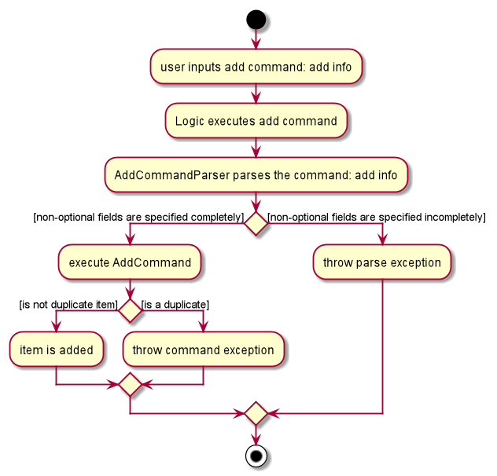

The following sequence diagram shows how the add operation generally works.
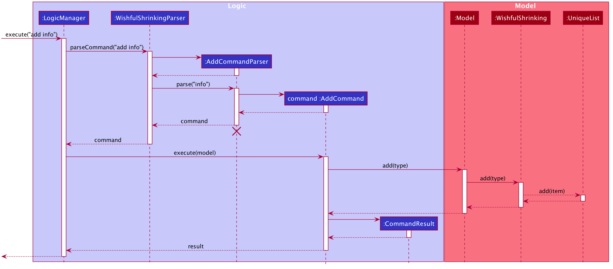

:bell: **Note** 

This is a condensed diagram. Several terms in the sequence diagram above have been substituted by a common term: 

Common Term | Recipe-specific term  | Ingredient-specific term
------------|-----------------|-------------------------------------------------------------------------   
add | `addR` | `addF`
AddCommandParser | `AddRecipeCommandParser` | `AddIngredientCommandParser`
AddCommand | `AddRecipeCommand` | `AddIngredientCommand`  
info | `"n/Salad i/Veggies - 100g c/100 img/images/healthy3.jpg instr/Eat tag/healthy"` | `"i/tomato"` 
add(type) | `addRecipe(type)` | `addIngredient(type)` 
type | `recipe` | `ingredient` 
 

Given below is an example usage scenario and how the mechanism behaves:

1. User inputs add recipe or ingredient command specifying the fields to add, to add them into the recipe
 list or ingredient list respectively.

1. After successfully parsing the user's input, the `AddRecipeCommand#execute(Model model)` or `AddIngredientCommand#execute(Model model)` method is called.

1. The recipe or ingredient that the user has input will be saved into Wishful Shrinking.

1. After the successfully adding the recipe or ingredient, a `CommandResult` object is instantiated and
 returned to `LogicManager`.   

### 3.1.2 Design Consideration - **Add Recipe**: 
#### Aspect 1: Concern while adding a new feature 
* Workflow must be consistent with other commands.   

#### Aspect 2: Should we allow adding duplicate recipes 
* **Alternative 1 (*current choice*):** Restricted to unique recipes.
  * Pros: Storage will contain unique recipes.
  * Cons: A uniqueness check must be done when the user adds recipe, which could make the app run slower.

* **Alternative 2:** Allows duplicate recipes.
  * Pros: Users will not be restricted to adding unique recipes.
  * Cons: Storage will be cluttered with duplicate recipes.   

### 3.1.3 Design Considerations - **Add Ingredient**: 
#### Aspect 1: Concern while adding a new feature 
* Workflow must be consistent with add recipe command.   

#### Aspect 2: How do we successfully parse the ingredients the user has added with the optional ingredient quantity 
* **Alternative 1 (*current choice*):** Add a quantity field in the Ingredient class as well as a
 IngredientParser class that parses the user input ingredients into an arraylist of Ingredient objects
  * Pros: User has more options on what ingredient information to store in Wishful Shrinking.
  * Cons: More work to implement.   

* **Alternative 2:** Make ingredient's quantity field compulsory
  * Pros: Easy to implement as command format is consistent.
  * Cons: Quantity may be irrelevant and outdated if it is compulsory for all.   

#### Aspect 3: Should we allow adding duplicate ingredients and stacking quantities 
* **Alternative 1 (*current choice*):** Restricted to unique ingredients.
  * Pros: Storage will contain unique ingredients.
  * Cons: A uniqueness check must be done when the user adds ingredients, which could make the app run slower.

* **Alternative 2:** Allows duplicate ingredients and stacking of quantities.
  * Pros: Users will not be restricted to adding unique ingredients. If they add duplicate ingredients with quantities, the quantities will stack,
   making it easier for them to change each ingredient's quantity.
  * Cons: If quantities for duplicate ingredients are in different units, they will not stack, so storage will be cluttered with duplicate ingredients.   

## 3.2 Eat Recipe Feature 

Eat Recipe feature allows the user to record their daily consumption. This feature will work with list consumption 
feature to output the total calories that the user has eaten.    

### 3.2.1 Implementation 
Command and Parser makes use of Substitutability:
* `EatRecipeCommand` extends `Command`
* `EatRecipeCommandParser` implements `Parser<EatRecipeCommand>`   

The following two diagrams shows how eat recipe operation works when `execute("eatR 1")` is called:

The following activity diagram shows how eat recipe operation works.
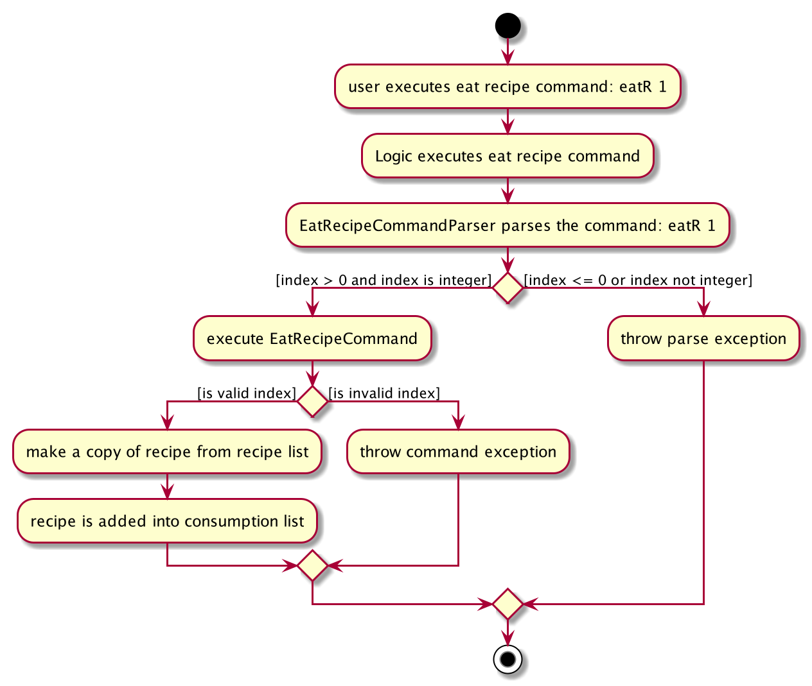

The following sequence diagram shows how eat recipe operation works.
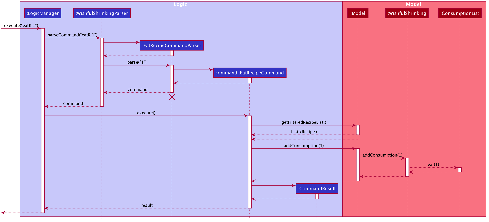

Given below is an example usage scenario and how the mechanism behaves:

1. User inputs eat recipe command to add a recipe to the consumption list.

1. After successfully parsing the user's input, the `EatRecipeCommand#method` method is called.

1. After successfully adding the recipe into the consumption list, a `CommandResult` object is instantiated and returned to `LogicManager`.   

### 3.2.2 Design Consideration: 
#### Aspect: What fields to extract from the eaten recipes to save in the Consumption List 
* **Alternative 1 (*current choice*):** Saves all the information from each recipe.
  * Pros: Easy to implement.
  * Cons: May have performance issues in terms of memory usage.

* **Alternative 2:** Saves the recipe's data that will be useful when listing consumption.
  * Pros: Will use less memory.
  * Cons: Not future proof as we need to restructure the whole command if want to show additional information from
   the recipe.   

## 3.3 List Features 
List features - `List Recipes`, `List Ingredients` and `List Consumption` allows the user to list out all the items
 that are saved in the recipe list, ingredient list or consumption list respectively.
The List Consumption feature will also calculate and show the total calories consumed so far.    

### 3.3.1 Implementation 
Command and Parser make use of Substitutability:
* `ListRecipeCommand`, `ListIngredientCommand` and `ListConsumptionCommand` extends `Command`   

The following two diagrams shows how list operation works when list recipes is called:   
`execute("recipes")`   
or list ingredients is called:    
`execute("fridge")`   
or list consumptions is called:   
 `execute("calories")` 

The following activity diagram shows how list operation generally works.
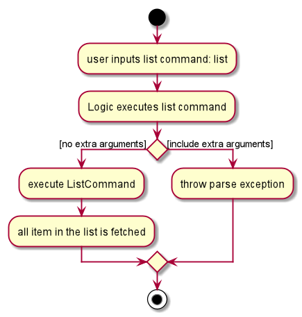

The following sequence diagram shows how list operation generally works.
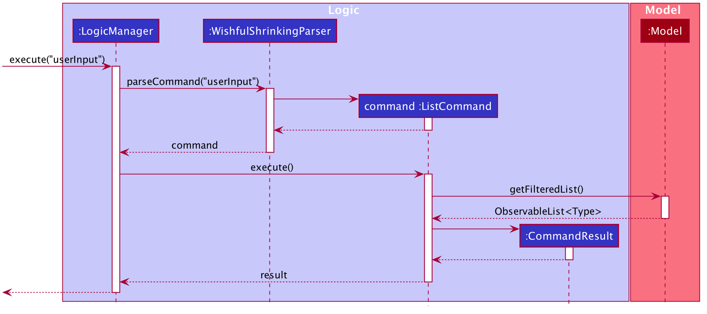

:bell: **Note**                                                                                                
                                                                                                               
This is a condensed diagram. Several terms in the sequence diagram above have been substituted by a common term
:  
                                                                                                               
Common Term | Recipe-specific term  | Ingredient-specific term | Consumption-specific term                                                 
------------|-----------------|----------------------------|---------------------------------------------       
userInput | `"recipes"` | `"fridge"` | `"calories"`                                     
ListCommand | `ListRecipeCommand` | `ListIngredientCommand` | `ListConsumptionCommand`                  
getFilteredList() | `getFilteredRecipeList()` | `getFilteredIngredientList()` | `getFilteredConsumptionList()`                                                          
Type | `Recipe` | `Ingredient` | `Consumption`

Given below is an example usage scenario and how the mechanism behaves:

1. User inputs the list command.

1. After successfully parsing the user's input, `ListRecipeCommand#execute(Model model)`, `ListIngredientCommand#execute(Model model)` or `ListConsumptionCommand#execute(Model model)` method is called.

1. After successfully getting the consumption list, a `CommandResult` object is instantiated and returned to
 `LogicManager`.   

#### 3.3.2 Design Consideration - **List Recipes**: 
##### Aspect 1: Concern while adding a new feature 
* Workflow must be consistent with other commands.   

##### Aspect 2: What recipe information to show and how to show them. 
* **Alternative 1 (*current choice*):** Show all fields and truncate if too long.
  * Pros: Show all relevant fields of all recipes consistently.
  * Cons: More inconvenience to see the full details of each recipe.

* **Alternative 2:** Show all fields and all information of every recipe.
  * Pros: Easy for users to see full recipe information.
  * Cons: Recipe list may become hard to browse and unaesthetic if there are long recipes.   

#### 3.3.3 Design Consideration - **List Ingredients**: 
##### Aspect 1: Concern while adding a new feature 
* Workflow must be consistent with other commands.   

##### Aspect 2: How to display ingredient name and quantity. 
* **Alternative 1 (*current choice*):** Display ingredient name first then explicitly label the quantity.
  * Pros: User can differentiate between ingredient name and quantity easily.
  * Cons: Might clutter up the UI as it should be easy to differentiate ingredient name and quantity.

* **Alternative 2:** Show quantity directly in front of ingredient name without any explicit quantity label.
  * Pros: Less clutter and repetition of the label 'quantity' at every ingredient.
  * Cons: For ingredient names with numbers, users might confuse them with the quantity.   

#### 3.3.4 Design Consideration - **List Consumption**: 
##### Aspect 1: Concern while adding a new feature 
* Workflow must be consistent with other commands.   

#### Aspect 2: What information in the recipe is useful to display in the consumption list 
* **Alternative 1 (*current choice*):** Listing each recipe with its image, name and calories.
  * Pros: Cleaner UI.
  * Cons: Other details that are not used become extra data in memory.

* **Alternative 2:** Listing each recipe's full information.
  * Pros: All the data saved is being used. 
  * Cons: Shows too much irrelevant information.   

## 3.4 Delete Features 
Delete features - `Delete Recipe`, `Delete Ingredient` and `Delete Consumption` allows the users to delete saved items 
in the recipe list, ingredient list or consumption list respectively.   

### 3.4.1 Implementation 
Command and Parser makes use of Substitutability:
* `DeleteRecipeCommand`, `DeleteIngredientCommand` and `DeleteConsumptionCommand` extends `Command`
* `DeleteRecipeCommandParser` implements `Parser<DeleteRecipeCommand>`
* `DeleteIngredientCommandParser` implements `Parser<DeleteIngredientCommand>`
* `DeleteConsumptionCommandParser` implements `Parser<DeleteConsumptionCommand>`   

The following two diagrams diagram show how delete operation generally works when delete recipe is called :  
`execute("deleteR 1")`  
or delete ingredient is called:  
`execute("deleteF 1")`   
or delete consumption is called:   
`execute("deleteC 1")`

The following sequence diagram shows how delete operation generally works. 

The following sequence diagram shows how delete operation generally works.

:bell: **Note**                                                                                                 
                                                                                                                
These are condensed diagrams. Several terms in the sequence and activity diagram above have been substituted by a
 common term
:                                                                                                            
                                                                                                                
Common Term | Recipe-specific term  | Ingredient-specific term | Consumption-specific term                          
------------|-----------------|----------------------------|---------------------------------------------       
delete | `deleteR` | `deleteF` | `deleteC`
DeleteCommandParser | `DeleteRecipeCommandParser` | `DeleteIngredientCommandParser` | `DeleteConsumptionCommandParser`                                                                     
DeleteCommand | `DeleteRecipeCommand` | `DeleteIngredientCommand` | `DeleteConsumptionCommand`                          
deleteType(1) | `deleteRecipe(1)` | `deleteIngredient(1)` | `deleteConsumption(1)`
remove(key) | `removeRecipe(key)` | `removeIngredient(key)` | `removeConsumption(key)`
    

Given below is an example usage scenario and how the mechanism behaves:
1. User inputs delete command with the item index, to delete that specific item from their respective recipe, ingredient or consumption list.

1. After successfully parsing the user's input, the `DeleteRecipeCommand#execute(Model model)`, `DeleteIngredientCommand#execute(Model model)` or `DeleteConsumptionCommand#execute(Model model)` method is called.

1. The item specified by the index will be deleted from its respective list.

1. After the successfully deleting the item, a `CommandResult` object is instantiated and returned to `LogicManager`.   

### 3.4.2 Design Consideration - **Delete Recipe**: 
#### Aspect 1: Concern while adding a new feature 
* Workflow must be consistent with other commands.   

#### Aspect 2: When the user deletes a recipe from the recipe list, should it also be deleted from the consumption list (if present) 
* **Alternative 1 (*current choice*):** Store a copy of the recipe in the consumption list so that it is not deleted if the recipe is deleted from the recipe list.
    * Pros: Recipes consumed will be accurate.                                       
    * Cons: Use additional memory space.    

* **Alternative 2:** Remove recipe in consumption list when deleting the recipe in recipe list.
    * Pros: No unknown recipe being saved in Wishful Shrinking.                                      
    * Cons: User could not accurately track their calories intake.    

### 3.4.3 Design Consideration - **Delete Ingredient**: 
#### Aspect: Concern while adding a new feature 
* Workflow must be consistent with other commands.   

### 3.4.4 Design Consideration - **Delete Consumption**: 
#### Aspect: Concern while adding a new feature 
* Workflow must be consistent with other commands.   

## 3.5 Edit Features 
Edit features - `Edit Recipe` and `Edit Ingredient` allows users to edit an existing recipe or ingredient in
 the recipe list or ingredient list respectively.   

### 3.5.1 Implementation 
Command and Parser make use of Substitutability:
* `EditRecipeCommand` and `EditIngredientCommand` extends `Command`
* `EditRecipeCommandParser` implements `Parser<EditRecipeCommand>`
* `EditIngredientCommandParser` implements `Parser<EditIngredientCommand>`   

The following two diagrams shows how edit operation generally works when a recipe is edited:  
 `execute("editR 1 n/Pea soup")`  
 or an ingredient is edited  
 `execute("editF 1 i/tomato")`
 
The following activity diagram shows how edit operation generally works.
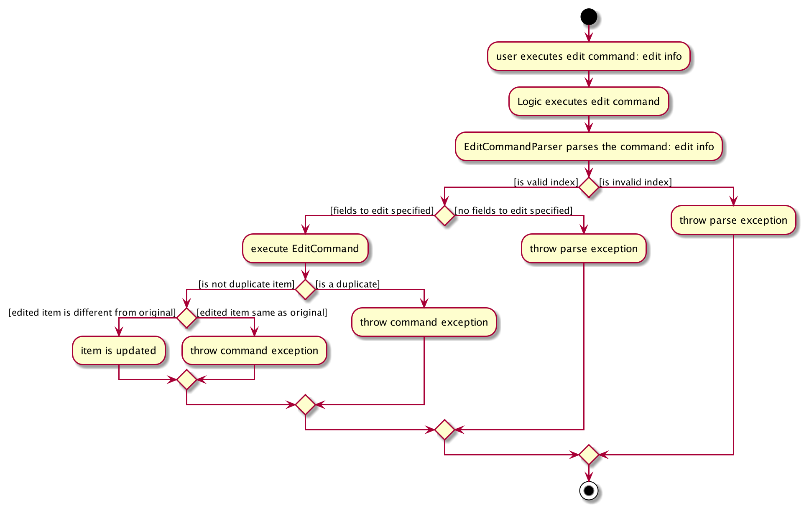

The following sequence diagram shows how edit operation generally works.
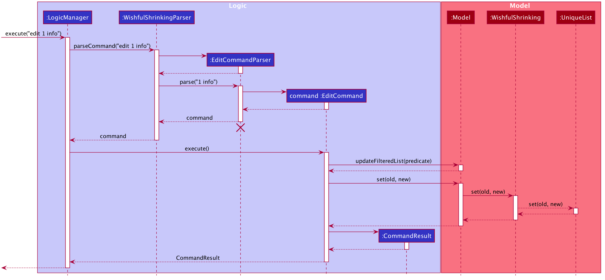

:bell: **Note**                                                                                               
                                                                                                              
These are condensed diagrams. Several terms in the sequence and activity diagram above have been substituted by a common
 term: 
                                                                                                              
Common Term | Recipe-specific term  | Ingredient-specific term                                                
------------|-----------------|-------------------------------------------------------------------------      
edit | `editR` | `editF`
EditCommandParser | `EditRecipeCommandParser` | `EditIngredientCommandParser`                                      
EditCommand | `EditRecipeCommand` | `EditIngredientCommand`                           
info | `"n/Pea soup"` | `"i/tomato"`                  
updateFilteredList(predicate) | `updateFilteredRecipeList(predicate)` | `updateFilteredIngredientList(predicate)`
set(old, new) | `setRecipe(oldRecipe, newRecipe)` | `setIngredient(oldIngredient, newIngredient)`
item | recipe | ingredient
 

Given below is an example usage scenario and how the mechanism behaves:
1. User inputs the edit command followed by an index specifying the recipe or ingredient to edit, then the values
 of fields to be modified.

1. After successfully parsing the user's input, the `EditRecipeCommand#execute(Model model)` or `EditIngredientCommand#execute(Model model)` method is called.

1. The recipe or ingredient that the user has input and modified will be saved into Wishful Shrinking's recipe list or ingredient list
 respectively.

1. After the successfully editing the recipe, a `CommandResult` object is instantiated and returned to `LogicManager`.   

### 3.5.2 Design Considerations - **Edit Recipe** 
#### Aspect 1: Concern while adding a new feature 
* Workflow must be consistent with other commands.   

#### Aspect 2: How to provide users with more ease while editing a recipe 
* **Alternative 1 (current choice):** User can directly edit on the existing recipe, after getting its command in the command box
  * Pros: Easy for users to edit a recipe.
  * Cons: Involves another command to set the command box to show the information of the recipe that the user
   wishes to edit. The command is elaborated in section [3.6 Get Edit Features](#36-get-edit-features).

* **Alternative 2:** User needs to retype the existing recipe's field that they wish to modify, if they want to
 retain any part of the existing field
  * Pros: Easy to implement.
  * Cons: Not user friendly.   

### 3.5.3 Design Considerations - **Edit Ingredient** 
#### Aspect 1: Concern while adding a new feature 
* Workflow must be consistent with other commands.   

#### Aspect 2: How to provide users with more ease while editing an ingredient 
* **Alternative 1 (current choice):** User can directly edit the existing ingredient, after getting its command in the command box
  * Pros: Easy for users to edit an ingredient.
  * Cons: Involves another command to set the command box to show the information of the ingredient that the
   user wishes to edit. The command is elaborated in section [3.6 Get Edit Features](#36-get-edit-features).

* **Alternative 2:** User needs to retype the existing ingredient's field that they wish to modify, if they want
 to retain any part of the existing field
  * Pros: Easy to implement.
  * Cons: Not user friendly.   

## 3.6 Get Edit features 
Get Edit features - `Get Edit Recipe` and `Get Edit Ingredient` allows users to get the command of an existing
 recipe or ingredient to edit.   

### 3.6.1 Implementation 
Command and Parser make use of Substitutability:
* `GetEditRecipeCommand` and `GetEditIngredientCommand` extends `Command`
* `GetEditRecipeCommandParser` implements `Parser<GetEditRecipeCommand>`
* `GetEditIngredientCommandParser` implements `Parser<GetEditIngredientCommand>`   

The following two diagrams shows how get edit operation generally works when get edit recipe is called:   
`execute("editR 1")`   
or get edit ingredient is called:  
 `execute("editF 1")` 

The following activity diagram shows how get edit operation generally works. 
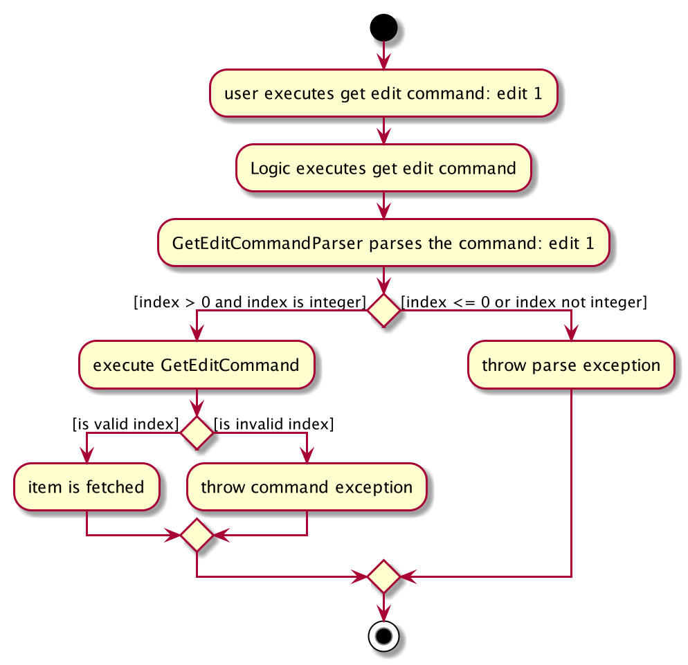

The following sequence diagram shows how get edit operation generally works.

:bell: **Note**                                                                                               
                                                                                                              
These are condensed diagrams. Several terms in the sequence and activity diagram above have been substituted by a common
 term: 
                                                                                                              
Common Term | Recipe-specific term  | Ingredient-specific term                                                
------------|-----------------|-------------------------------------------------------------------------      
edit | `editR` | `editF`
GetEditCommandParser | `GetEditRecipeCommandParser` | `GetEditIngredientCommandParser`                                      
GetEditCommand | `GetEditRecipeCommand` | `GetEditIngredientCommand`                           
commandType | `editR <existing recipe>` | `editF <existing ingredient>`
item | recipe | ingredient

Given below is an example usage scenario and how the mechanism behaves:
1. User inputs the get edit command followed by an index specifying the recipe or ingredient to edit.

1. After successfully parsing the user's input, the `GetEditRecipeCommand#execute(Model model)`  or `GetEditIngredientCommand#execute(Model model)` method is called.

1. The recipe or ingredient that the user has specified with the get edit command will be stored in
 CommandResult. This will be used to set the command box on the main window.

1. After, a `CommandResult` object is instantiated and returned to `LogicManager`.   

### 3.6.2 Design Considerations - **Get Edit Recipe** 
#### Aspect: Concern while adding a new feature 
* Workflow must be consistent with other get edit commands.   

### 3.6.3 Design Considerations - **Get Edit Ingredient** 
#### Aspect: Concern while adding a new feature 
* Workflow must be consistent with other get edit commands.   

## 3.7 Select Recipe Feature 
Select Recipe feature allows users to select and view a recipe's information from the recipe list.   

### 3.7.1 Implementation 
Command and Parser make use of Substitutability:
* `SelectRecipeCommand` extends `Command`
* `SelectRecipeCommandParser` implements `Parser<SelectRecipeCommand>`   

The following two diagrams shows how select recipe works when `execute("selectR 1")` is called.

The following acitivity diagram shows how select recipe works.
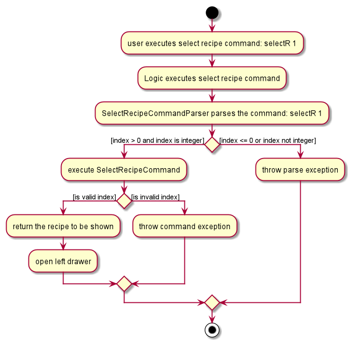

The following sequence diagram shows how select recipe works.

Given below is an example usage scenario and how the mechanism behaves:
1. User inputs the select recipe command followed by an index specifying the recipe.

1. After successfully parsing the user's input, the `SelectRecipeCommand#execute(Model model)` method is called.

1. After successfully getting the recipe from the recipe list, a `CommandResult` object is instantiated and returned to
 `LogicManager`.   

### 3.7.2 Design Considerations 
#### Aspect: Concern while adding a new feature 
* Workflow must be consistent with other commands.   

## 3.8 Search Features 
Search features - `Search Recipe` and `Search Ingredient` allows users to search for recipes or ingrdients in the
 recipe list or ingredient list respectively. 
 

:bulb: 
**Tip** Recipes can be searched by name, tag, or ingredients. Ingredients can be searched by name.

   

### 3.8.1 Implementation 
Command and Parser make use of Substitutability:
* `SearchRecipeCommand` and `SearchIngredientCommand` extends `Command`
* `SearchRecipeCommandParser` implements `Parser<SearchRecipeCommand>`
* `SearchIngredientCommandParser` implements `Parser<SearchIngredientCommand>`   

The following sequence diagram shows how the search operation generally works when searching for recipes:  
 `execute("searchR n/burger")`   
 or searching for ingredients:   
 `execute("searchF avocado")`

The following activity diagram shows how search operation generally works:
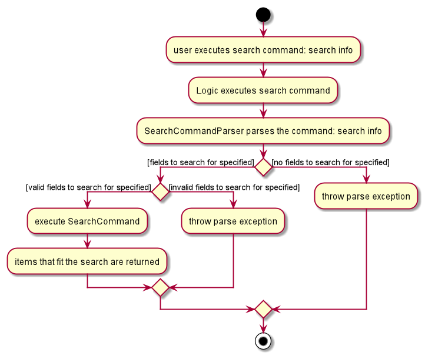

The following sequence diagram shows how search operation generally works:

:bell: **Note**                                                                                                   
                                                                                                                  
This is a condensed diagram. Several terms in the sequence diagram above have been substituted by a common term:     
                                                                                                                  
Common Term | Recipe-specific term  | Ingredient-specific term                                                    
------------|-----------------|-------------------------------------------------------------------------          
search | `searchR` | `searchF`                                                                                             
SearchCommandParser | `SearchRecipeCommandParser` | `SearchIngredientCommandParser`                                        
SearchCommand | `SearchRecipeCommand` | `SearchIngredientCommand`                                                          
info |  `"n/burger"` | `"avocado"`                      
updateFilteredList(predicate) | `updateFilteredRecipeList(predicate)` | `updateFilteredIngredientList(predicate)`

Given below is an example usage scenario and how the mechanism behaves:
1. User inputs the search recipe or search ingredient command followed by the fields to filter by, to search for the
 recipes or ingredients they want.

1. After successfully parsing the user's input, the `SearchRecipeCommand#execute(Model model)` or `SearchIngredientCommand#execute(Model model)` method is called.

1. The list of recipes or ingredients that fit the user's search will be returned to them.

1. After the successfully searching the recipes or ingredients, a `CommandResult` object is instantiated and returned to `LogicManager`.   

### 3.8.2 Design Considerations - **Search Recipe** 
#### Aspect 1: Concern while adding a new feature 
* Workflow must be consistent with other commands.   

#### Aspect 2: How do we successfully search and filter the recipes based on the user's search  
* **Alternative 1 (*current choice*):** User can only search for recipes based on one field (name, tag or
 ingredient) at a time
  * Pros: Easy to implement.
  * Cons: User's cannot filter the recipes by two or three fields at once.

* **Alternative 2:** User can search for recipes by all fields at once
  * Pros: Harder to implement.
  * Cons: Users can filter the recipes by two or three fields at once, making the search filter more helpful and efficient.   

### 3.8.3 Design Considerations - **Search Ingredient** 
#### Aspect: Concern while adding a new feature 
* Workflow must be consistent with other searching commands e.g. search recipe.   

## 3.9 Recommend feature 

### 3.9.1 Implementation 
Recommend feature allows users to get the list of recipes whose ingredients matches the ingredients in their fridge.    

Substitutability is used in Command:
* `RecommendCommand` extends `Command`   

The following two diagrams shows how recommend operation works when `execute("recommend")` is called:

The following activity diagram shows how recommend operation works.
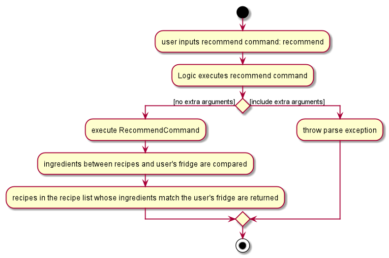

The following sequence diagram shows how recommend operation works.

Given below is an example usage scenario and how the mechanism behaves at each step.

1. User inputs the recommend command to get the recommended recipes.

1. After successfully parsing user's input, the `RecommendCommand#execute(Model model)` method is called.

1. The list of recommended recipes will be returned to the user.

1. After the successfully recommending recipes, a `CommandResult` object is instantiated and returned to `LogicManager`.   

### 3.9.2 Design Considerations 
#### Aspect 1: How do we quickly and accurately compare ingredients between each recipe and the user's fridge 
* **Alternative 1 (*current choice*):** Compare the exact ingredients in each recipe to the user's ingredients in the fridge
  * Pros: Easy to implement
  * Cons: Ingredients might not match if the spellings are different, or if the ingredient have similar names e.g.
   mozarella and cheese. Additionally, if users do not add basic ingredients into their fridge, e.g. salt
    and pepper, many recipes will not be recommended to them.   

* **Alternative 2:** Using tries to compare ingredients in the fridge
    * Pros: Faster and accurate.
    * Cons: Hard to implement.   
 
#### Aspect 2: Should we take an ingredient's quantity into account when recommending recipes  
* **Alternative 1 (*current choice*):** Recommending recipes will not take ingredients' quantites into account
  * Pros: Easy to implement.
  * Cons: The quantity of ingredients in the user's fridge might be less than the quantities in the recipe.
  
* **Alternative 2:** Recommending recipes will take ingredients' quantites into account and only recommend recipes
 whose ingredients have a lower quantity than the ingredients in the user's fridge
  * Pros: Harder to implement, user might not have input their ingredient's quantities.
  * Cons: Recommended recipes will be more accurate.    

## 3.10 Clear Features 
Clear features - `Clear Recipes`, `Clear Ingredients` and `Clear Consumption` allows user to clear all the items
 that have been saved in the recipe list, ingredient list or consumption list respectively.    

### 3.10.1 Implementation 
Command and Parser make use of Substitutability:
* `ClearRecipeCommand`, `ClearIngredientCommand` and `ClearConsumptionCommand` extends `Command`   

The following two diagrams shows how clear operation generally works when clear recipes:   
`execute("clearR")`   
or clear fridge:    
`execute("clearF")`   
or clear consumptions:   
 `execute("clearC")` is called:

The following activity diagram shows how clear operation generally works.
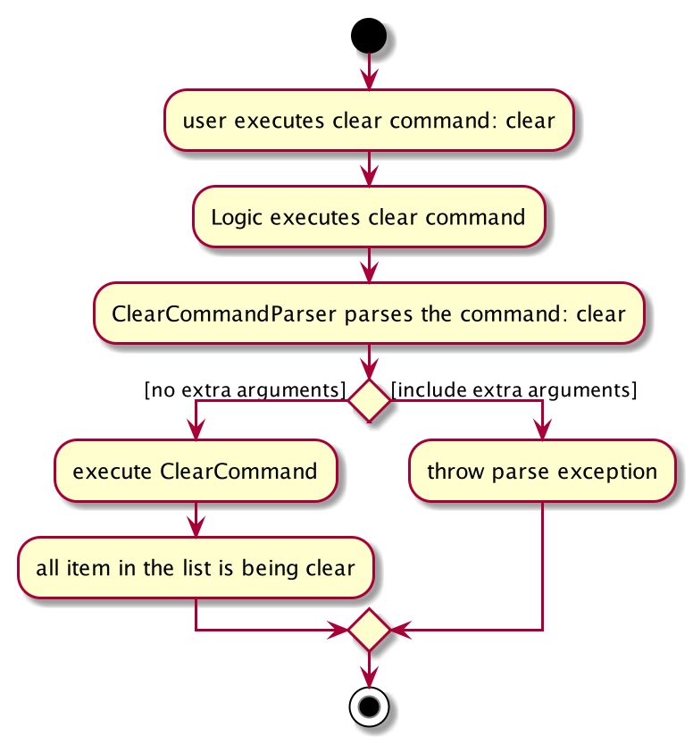

The following sequence diagram shows how clear operation generally works.

:bell: **Note**                                                                                                    
                                                                                                                   
This is a condensed diagram. Several terms in the sequence diagram above have been substituted by a common term: 

Common Term | Recipe-specific term  | Ingredient-specific term | Consumption-specific term                          
------------|-----------------|----------------------------|---------------------------------------------       
clear | `"clearR"` | `"clearF"` | `"clearC"`
ClearCommand | `ClearRecipeCommand` | `ClearIngredientCommand` | `ClearConsumptionCommand`                                                                     
clearType() | `clearRecipe()` | `clearIngredient()` | `clearConsumption()`             

Given below is an example usage scenario and how the mechanism behaves:

1. User inputs the clear command.

1. After successfully parsing the user's input, the `ClearRecipeCommand#execute(Model model)`, `ClearIngredientCommand#execute(Model model)` or `ClearConsumptionCommand#execute(Model model)` method is called.

1. After successfully clearing the specified list, a `CommandResult` object is instantiated and returned to
 `LogicManager`.   

### 3.10.2 Design Consideration - **Clear Recipes**: 
#### Aspect: Concern while adding a feature 
* Workflow must be consistent with other commands.   

### 3.10.3 Design Consideration - **Clear Ingredients**: 
#### Aspect: Concern while adding a new feature 
* Workflow must be consistent with other commands.   

### 3.10.4 Design Consideration - **Clear Consumption**: 
#### Aspect: Concern while adding a new feature 
* Workflow must be consistent with other commands.   

--------------------------------------------------------------------------------------------------------------------

# 4. **Documentation, Logging, Testing, Configuration, Dev-ops** 

* [Documentation guide](Documentation.md)
* [Testing guide](Testing.md)
* [Logging guide](Logging.md)
* [Configuration guide](Configuration.md)
* [DevOps guide](DevOps.md)   

--------------------------------------------------------------------------------------------------------------------

# 5. **Appendix A: *Requirements*** 

## 5.1 Product Scope 

**Target user profile**:

* has a need to better manage their diet
* has personal recipes to keep track of
* prefers desktop apps over other types
* can type fast
* prefers typing to mouse interactions
* is reasonably comfortable using CLI apps   

**Value proposition**: manage diet better and faster than mobile or GUI apps   

## 5.2 User Stories 

Priorities: High (must have) - `* * *`, Medium (nice to have) - `* *`, Low (unlikely to have) - `*`

| Priority | As a...           | Who...                                                        | I want to...                                                           | So that I can...                                                                      |
|----------|-------------------|---------------------------------------------------------------|------------------------------------------------------------------------|---------------------------------------------------------------------------------------|
| **       | Potential user    | wants to work towards being healthier                         | be able to find out and read about the product before using it         | gauge if it is suitable before spending time to install it                            |
| ***      | Potential user    | busy and wants convenience                                    | be able to read clearly how to install and run the app                 | save time and effort on the initial set up                                            |
| **       | Potential user    | busy and wants efficiency                                     | be able to read how to best use the product                            | I do not waste time and effort trying to figure out how to optimally use it           |
| **       | Potential user    | is more visual                                                | be able to see the app populated with sample data                      | easily see and learn how the app will look like when in use                           |
| ***      | Potential user    | wants gather my recipes                                       | add my recipes onto the computer                                       | save my recipes in one location                                                       |
| **       | Potential user    | has many recipes                                              | view my created recipes easily                                         | better manage all my recipes                                                          |
| **       | Potential user    | is flexible                                                   | edit my added recipes according to my preference                       | save my ideal, personal recipes                                                       |
| ***      | Potential user    | wants to have a tidy recipe collection                        | delete existing recipes                                                | better select my recipes that are ideal for my personal diet                          |
| ***      | Potential user    | lack healthy recipe resources                                 | have access to resources of healthy recipes                            | follow through balanced recipes to improve my diet                                    |
| ***      | Potential user    | is too busy to look for my ideal recipe                       | have recipe recommendations                                            | explore recipes that are personalised to me and my diet                               |
| ***      | Potential user    | is forgetful                                                  | keep track of items in my fridge                                       | make the most out of the fresh ingredients in my fridge                               |
| **       | Potential user    | wants to minimise time taken to choose a recipe               | easily view all my available ingredients at a glance                   | quickly choose a suitable recipe                                                      |
| ***      | Potential user    | wants to be precise                                           | edit my ingredients in the fridge                                      | have an accurate list of ingredients in the fridge database that mimics my real fridge |
| ***      | Potential user    | wants to be organised                                         | remove ingredients from fridge                                         | have an updated list of ingredients in my fridge                                      |
| ***      | Potential user    | find it hard to keep track of my diet                         | track my food intake and calories                                      | better manage my daily diet                                                           |
| **       | Intermediate user | proficient in typing and using computers                      | to utilises my typing and computers skills such as on a CLI            | efficiently use the app to manage my diet                                             |
| **       | Intermediate user | likes aesthetics and cooking                                  | use a diet app that has impressive UI, smooth animations and effects   | have a good user experience navigating the app                                        |
| *        | Intermediate user | wants convenience in choosing suitable recipes                | know what ingredients I am missing from a recipe                       | know which ingredients to buy to follow a recipe                                      |
| **       | Intermediate user | wants to cook a meal but is limited by my ingredients variety | browse recipes that only use the ingredients I have                    | more easily select and follow a recipe                                                |
| ***      | Intermediate user | is seeking customizable recipes                               | customise and save the supplied recipes in the database                | personalise every recipe for my specific diet                                         |
| *        | Intermediate user | want to make more efficient use of my time                    | filter for recipes that can be pre-cooked ahead of time                | plan and cook meals ahead of time to save time spent on cooking                       |
| *        | Intermediate user | wants a meal that can be quickly prepared                     | easily search for a recipe that has short preparation and cooking time | quickly cook and enjoy my meal                                                        |
| **       | Intermediate user | wants to manage my ingredients                                | easily find the ingredients i want                                     | quickly find ingredients and save time on home cooking                                |
| *        | Intermediate user | wants to be healthier                                         | create my diet plan                                                    | better stick to a healthy diet.                                                       |
| *        | Intermediate user | keen on following a certain diet                              | keep track of my recipes for that specific diet                        | better stick to my diet plan                                                          |
| *        | Intermediate user | organise my diet plan                                         | remove recipes that do not belong in a certain diet plan               | have a neat and accurate diet plan                                                    |
| **       | Intermediate user | want to track my diet progress                                | want to view my calorie and food intake statistics                     | review my diet and work on being even healthier                                       |
| **       | Expert user       | is forgetful                                                  | have a table of commands and shortcuts                                 | use the app more efficiently.                                                        |
| **       | Expert user       | is organized                                                  | group recipes into labelled sections by adding tags                    | easily find recipes of the same section                                               |
| *        | Expert user       | is neat                                                       | remove recipes from labelled sections                                  | avoid each section being cluttered with recipes that don't belong in the section      |
| **       | Expert user       | like to browse recipe                                         | filter the recipe base by my tags                                      | browse the recipe easily                                                              |
| *        | Expert user       | likes convenience                                             | be able to export the recipes in the app to another device             | refer to the data from another device and share it with others                        |
| *        | Expert user       | is a developer                                                | customize the app to my own preferences                                | contribute and extend the app further                                                 |

## 5.3 Use Cases 
For all use cases below, the **System** is the `Wishful Shrinking` and the **Actor** is the `User`, unless specified otherwise.

:bell: **Note**                                                                                                    
                                                                                                                   
These are common extensions that can apply to some commands. Let x be the step the extension begins at.

**Invalid Index Extension** applicable to `delete`, `list`, `edit`, `select` commands 
* *X*a. The given index is not a positive integer that is greater than 0 or not a valid index in the item list.
    * *X*a1. Wishful Shrinking shows an error message.
    * *X*a2. User enters new index.
        Step *X*a1 to Step (*X*+1)a2 are repeated until the index entered is valid.
      Use case resumes at step *X*+1.

### 5.3.1 Recipe-Related Use Cases 

**Use case: Add a recipe**

**MSS**

  1. User chooses to add a recipe to the list of recipes.
  1. Wishful Shrinking adds the recipe to the list of recipes.

     Use case ends.
     
**Extensions**

* 1a. The new recipe is a duplicate or invalid recipe.
    * 1a1. Wishful Shrinking shows an error message.
    * 1a2. User enters new recipe data.
    Steps 1a1-1a2 are repeated until the data entered is valid.
    
    Use case resumes at step 2.   

**Use case: View recipes**

**MSS**

  1. User requests to view all recipes that are in the recipe list.
  1. Wishful Shrinking lists all the recipes that are in the recipe list, with their respective information.

     Use case ends.

**Extensions**

* 2a. The list of recipes is empty.

  Use case ends.   
  
**Use case: Delete a recipe**

**MSS**

  1. User requests to view the recipes in the recipe list.
  1. Wishful Shrinking shows a list of recipes that are in the recipe list.
  1. User requests to delete a specific recipe in the list.
  1. Wishful Shrinking deletes the recipe.

     Use case ends.

**Extensions**

* 2a. The list of recipes is empty.

  Use case ends.

      :bell: **Note** Invalid Index Extension is applicable where beginning step *X* = step 3

   
      
**Use case: Get a recipe to edit**

**MSS**

  1. User requests to view the recipes in the recipe list.
  1. Wishful Shrinking shows a list of recipes that are in the recipe list.
  1. User requests to edit a specific recipe in the list.
  1. Wishful Shrinking displays the recipe in the command box for the user to directly edit.

     Use case ends.
     
     
**Extensions**

* 2a. The list of recipes is empty.

  Use case ends.

      :bell: **Note** Invalid Index Extension is applicable where beginning step *X* = step 3

   
      
**Use case: Edit recipe**

**MSS**

  1. User edits a recipe in the recipe list.
  1. Wishful Shrinking edits the specified recipe and saves it in the recipe list.

     Use case ends.
     
**Extensions**

* 1a. The new recipe is a duplicate, unchanged or invalid recipe.
    * 1a1. Wishful Shrinking shows an error message.
    * 1a2. User enters new recipe data.
    Steps 1a1-1a2 are repeated until the data entered is valid.
    
    Use case resumes from step 2.
   

      :bell: **Note** Invalid Index Extension is applicable where beginning step *X* = step 1

 

   
      
**Use case: Search for recipe**

**MSS**

  1. User wants to search for recipes by their title, ingredients or tags in the recipe list.
  1. Wishful Shrinking lists the recipes that has the specified title, ingredients or tags, if present.

     Use case ends.
     
**Extensions**
* 1a. The search fields are invalid.
    * 1a1. Wishful Shrinking shows an error message.
    * 1a2. User enters new field data.
    Steps 1a1-1a2 are repeated until the data entered is valid.
    
    Use case resumes at step 2.   
  
**Use case: Recommend recipes**

**MSS**

  1. User wants to get recommended recipes based on the ingredients in their fridge.
  1. Wishful Shrinking lists the recipes whose ingredients the user has, if present.

     Use case ends.    

**Use case: Select a recipe in the recipe list**

**MSS**

  1. User requests to view a single recipe.
  1. Wishful Shrinking opens a drawer that contains only the requested recipe.
  1. User requests to close the drawer.
  1. Wishful Shrinking closes the drawer.

     Use case ends.
     
**Extensions**

  :bell: **Note** Invalid Index Extension is applicable where beginning step *X* = step 1

  
     
**Extensions**

* 2a. The given index is invalid.

    * 2a1. Wishful Shrinking shows an error message.

      Use case ends.   

**Use case: Clear all recipes in recipe list**

**MSS**

  1. User requests to clear all the recipes in the recipe list.
  1. Wishful Shrinking clears the recipe list.

     Use case ends.   
     
### 5.3.2 Fridge-Related Use Cases 
**Use case: Add ingredients**

**MSS**

  1. User chooses to add ingredients into the fridge.
  1. Wishful Shrinking adds the specified ingredients into the fridge.

     Use case ends.
     
**Extensions**

* 1a. The new ingredient is a duplicate or invalid ingredient.
    * 1a1. Wishful Shrinking shows an error message.
    * 1a2. User enters new ingredient data.
    Steps 1a1-1a2 are repeated until the data entered is valid.
    
    Use case resumes at step 2.   
	  
**Use case: View ingredients**

**MSS**

  1. User requests to view all ingredients that are in the fridge.
  1. Wishful Shrinking lists all the ingredients that are in the fridge.

     Use case ends.

**Extensions**

* 2a. The fridge is empty.

  Use case ends.    
	  
**Use case: Delete an ingredient**

**MSS**

  1. User requests to view the ingredients in the fridge.
  1. Wishful Shrinking shows a list of ingredients that are in the fridge.
  1. User requests to delete a specific ingredient in the list.
  1. Wishful Shrinking deletes the ingredient.

     Use case ends.

**Extensions**

* 2a. The fridge is empty.

  Use case ends.

     :bell: **Note** Invalid Index Extension is applicable where beginning step *X* = step 3

   
	  
**Use case: Get an ingredient to edit**

**MSS**

  1. User requests to view the ingredients in the fridge.
  1. Wishful Shrinking shows a list of ingredients that are in the fridge.
  1. User requests to edit a specific ingredient in the fridge.
  1. Wishful Shrinking displays the ingredient in the command box for the user to directly edit.

     Use case ends.
     
**Extensions**

* 2a. The fridge is empty.

  Use case ends.

      :bell: **Note** Invalid Index Extension is applicable where beginning step *X* = step 3

   
	  
**Use case: Edit ingredient**

**MSS**

  1. User edits an ingredient in the fridge.
  1. Wishful Shrinking edits the specified ingredient and saves it in the fridge.

     Use case ends.
     
**Extensions**

* 1a. The new ingredient is a duplicate, unchanged or invalid ingredient.
    * 1a1. Wishful Shrinking shows an error message.
    * 1a2. User enters new data.
    Steps 1a1-1a2 are repeated until the data entered is valid.
    
    Use case resumes from step 2.

      :bell: **Note** Invalid Index Extension is applicable where beginning step *X* = step 1

   
  
	  
**Use case: Search for ingredient**

**MSS**

  1. User wants to search for ingredients by their name in the fridge.
  1. Wishful Shrinking lists the ingredients in the fridge that has the specified name, if present.

     Use case ends.
     
**Extensions**
* 1a. The search field is invalid.
    * 1a1. Wishful Shrinking shows an error message.
    * 1a2. User enters new field data.
    Steps 1a1-1a2 are repeated until the data entered is valid.
    
    Use case resumes at step 2.   

**Use case: Clear all ingredients in fridge**

**MSS**

  1. User requests to clear all the ingredients in the fridge.
  1. Wishful Shrinking clears the fridge.

     Use case ends.   

### 5.3.3 Consumption-Related Use Cases 
**Use case: Eat Recipe**

**MSS**

  1. User requests to view recipes in the recipe list.
  1. Wishful Shrinking shows a list of recipes that are in the recipe list.
  1. User requests to eat a specific recipe in the list.
  1. Wishful Shrinking add the recipe to consumption list.

     Use case ends.

**Extensions**

* 2a. The recipe list is empty.

  Use case ends.

  :bell: **Note** Invalid Index Extension is applicable where beginning step *X* = step 3

   
      
**Use case: View recipes eaten**

**MSS**

  1. User requests to view all recipes that are in the consumption list.
  1. Wishful Shrinking lists all recipes that are in the consumption list.

     Use case ends.

**Extensions**

* 2a. The consumption list is empty.

    Use case ends.   

**Use case: Delete a recipe in the consumption list**

**MSS**

  1. User requests to view the consumption list.
  1. Wishful Shrinking shows a list of recipes that are in the consumption list.
  1. User requests to delete a specific recipe in the list.
  1. Wishful Shrinking deletes the consumed recipe.

     Use case ends.

**Extensions**

* 2a. The consumption list is empty.

  Use case ends.

  :bell: **Note** Invalid Index Extension is applicable where beginning step *X* = step 3

   

**Use case: Clear all recipes in consumption list**

**MSS**

  1. User requests to clear all the recipes in the consumption list.
  1. Wishful Shrinking clears the consumption list.

     Use case ends.   

### 5.3.4 Other Use Cases 
**Use case: View help**

**MSS**

  1. User wants to view all valid commands they can use.
  1. Wishful Shrinking shows a window with a link to Wishful Shrinking's user guide.

     Use case ends.   
     
**Use case: Exit Wishful Shrinking**

**MSS**

  1. User wants to exit Wishful Shrinking.
  1. Wishful Shrinking shuts down.

     Use case ends.        
     

## 5.4 Non-Functional Requirements 

1.  Should work on any _mainstream OS_ as long as it has Java `11` or above installed.
1.  Should be able to hold up to 1000 recipes and ingredients without a noticeable sluggishness in performance for typical usage.
1.  Reserve an amount of 5MB memory for the baseline recipe data.
1.  A user with above average typing speed for regular English text (i.e. not code, not system admin commands) should be able to accomplish most of the tasks faster using commands than using the mouse.  
1.  Search-related features might be slow if there are more than 2000 recipes or ingredients in the database.
1.  The application does not need internet connection to function, but the user can use the internet connection to download images for recipes.
1.  The application uses local database.
1.  The local database will be immediately updated after each updating command.   

## 5.5 Glossary 

Term | Explanation
--------|------------------
**Wishful Shrinking** | Can refer to name of the application as a whole or to the app’s storage file. 
**Fridge** | A personalised storage that contains all the ingredients that a user has. 
**Recipe** | A set of cooking instructions that describes how to prepare a meal and the ingredients required. 
**Ingredient** | Foods that can be used to prepare a particular dish according to a recipe. 
**Consumption** | A tracker which calculates and displays your calorie intake based on the recipes you have consumed as well as a list of recipes consumed. 
**Mainstream OS** | Windows, Linux, Unix, OS-X.

--------------------------------------------------------------------------------------------------------------------

# 6. **Appendix B: *Instructions for Manual Testing*** 

Given below are instructions to test the app manually.

:information_source: **Note:** These instructions only provide a starting point for testers to work on;
testers are expected to do more *exploratory* testing.

## 6.1 Launch and Shutdown 

1. Initial launch

   1. Download the jar file and copy into an **empty folder**

   1. **Double-click** the jar file OR start the app using **CLI** and type `java -jar wishfulShrinking.jar`. 
   Expected: Shows the GUI with a set of sample recipes. The window size may not be optimum.

1. Saving window preferences

   1. Resize the window to an optimum size. Move the window to a different location. Close the window.

   1. Re-launch the app by double-clicking the jar file. 
       Expected: The most recent window size and location is retained.   

## 6.2 Adding a recipe 

1. Adding a recipe with all required fields into Wishful Shrinking’s recipe list.

    1. Prerequisites: The recipe being added is not already in Wishful Shrinking.
    
    1. Test case: `addR n/salad i/tomato, lettuce c/100 instr/Cook. Eat.` 
       Expected: The recipe salad, with all its information, will be added to the recipe list on the left of Wishful Shrinking. The result box will show the information of that recipe.

    1. Test case: `addR n/burger i/bread, meat c/200 instr/Cook. Eat. img/images/healthy1.jpg t/tasty` 
       Expected: The recipe burger, with all its information, will be added to the recipe list on the left of Wishful Shrinking. This test case differs with the previous test case in that it has the optional fields image and tags.
    
    1. Test case: `addR n/salad i/tomato c/100`  
       Expected: An error message will be shown, as the non-optional field instruction is omitted. The message will show the correct input format of the `addR` command, and your command in the command box will turn red.   
       

## 6.3 Adding an ingredient 

1. Adding an ingredient into Wishful Shrinking’s ingredient list.

    1. Prerequisites: The ingredient being added is not already in Wishful Shrinking.
    
    1. Test case: `addF i/banana`  
      Expected: The ingredient banana will be added to the ingredient list on the left of Wishful Shrinking. The result box will show the information of that ingredient.

    1. Test case: `addF i/tomato -1kg`  
       Expected: The ingredient tomato, along with its quantity, will be added to the ingredient list on the left of Wishful Shrinking. This test case differs with the previous test case in that it has the optional quantity.
       
    1. Test case: `addF i/milk -0`  
       Expected: An error message will be shown, as the quantity is invalid. The message will show the correct input format of the `addF` command, and your command in the command box will turn red.   
       
       
## 6.4 Eating a recipe 

1. Eating a recipe at a specific index in the recipe list and adding it into Wishful Shrinking’s consumption list.

    1. Prerequisites: Wishful Shrinking’s recipe list is not empty.
    
    1. Test case: `eatR 1`  
       Expected: First recipe in the displayed recipe list will be added into Wishful Shrinking’s consumption list. The result box will show the name and calories of that recipe.

    1. Test case: `eatR 0`  
       Expected:  No recipe is eaten. An error message will be shown, as the recipe index is invalid. The message will show the correct input format of the `eatR` command, and your command in the command box will turn red.

    1. Other incorrect `eatR` commands to try: `eatR`, `eatR x`, … (where x is larger than the recipe list size) 
       Expected: Similar to previous test case.   

## 6.5 Listing Recipes 

1. Listing out all the recipes in Wishful Shrinking’s recipe list.

    1. Prerequisites: Wishful Shrinking’s recipe list is not empty.
     
    1. Test case: `recipes`  
       Expected: The full recipe list will be displayed on the left of Wishful Shrinking. The result box will show the names of all the recipes.

    1. Test case: `recipes x` (where x is any additional arguments)  
       Expected: An error message will be shown, as `recipes` does not have any arguments. The message will show the correct input format of the `recipes` command, and your command in the command box will turn red.   

## 6.6 Listing Ingredients 

1. Listing out all the ingredients in Wishful Shrinking’s ingredient list.

    1. Prerequisites: Wishful Shrinking’s ingredient list is not empty.
    
    1. Test case: `fridge`  
       Expected: The full ingredient list will be displayed on the left of Wishful Shrinking. The result box will show the information of all the ingredients.

    1. Test case: `fridge x` (where x is any additional arguments)  
       Expected: An error message will be shown, as `fridge` does not have any arguments. The message will show the correct input format of the `fridge` command, and your command in the command box will turn red.   

## 6.7 Listing Consumption 

1. Listing out all the recipes eaten in Wishful Shrinking’s consumption list.

    1. Prerequisites: Wishful Shrinking’s consumption list is not empty.
    
    1. Test case: `calories`  
       Expected: The full consumption list will be displayed on the left of Wishful Shrinking. The result box will show the names and calories of recipes eaten, as well as the total calories consumed.

    1. Test case: `calories x` (where x is any additional arguments)  
       Expected: An error message will be shown, as `calories` does not have any arguments. The message will show the correct input format of the `calories` command, and your command in the command box will turn red.   
        
## 6.8 Deleting a recipe 

1. Deleting a recipe at a specific index while all recipes are being shown in the Wishful Shrinking's recipe list.

    1. Prerequisites: List all recipes using the `recipes` command. Wishful Shrinking’s recipe list is not empty.
    
    1. Test case: `deleteR 1`  
       Expected: Recipe with index 1 will be deleted from the Wishful Shrinking's recipe list. The result box will show details of the deleted recipe.
       
    1. Test case: `deleteR 0`  
       Expected: An error message will be shown, as the recipe with index 0 is not present. The message will show the correct input format of the `deleteR` command, and your command in the command box will turn red.
       
    1. Other incorrect `deleteR` commands to try: `deleteR`, `deleteR x`, … (where x is larger than the recipe list size or x is not a positive integer)  
       Expected: Similar to previous test case.   
       
     
## 6.9 Deleting an ingredient 

1. Deleting an ingredient at a specific index while all recipes are being shown in the Wishful Shrinking's ingredient list.

    1. Prerequisites: List all recipes using the `fridge` command. Wishful Shrinking’s ingredient list is not empty.
    
    1. Test case: `deleteF 1`  
       Expected: Ingredient with index 1 will be deleted from the Wishful Shrinking's ingredient list. The result box will show details of the deleted ingredient.
       
    1. Test case: `deleteF 0`  
       Expected: An error message will be shown, as the ingredient with index 0 is not present. The message will show the correct input format of the `deleteF` command, and your command in the command box will turn red.
       
    1. Other incorrect `deleteF` commands to try: `deleteF`, `deleteF x`, … (where x is larger than the ingredient list size or x is not a positive integer)  
       Expected: Similar to previous test case.     
       
       
## 6.10 Deleting an eaten recipe 

1. Deleting an eaten recipe at a specific index while all eaten recipes are being shown in the Wishful Shrinking's consumption list.

    1. Prerequisites: List all eaten recipes using the `calories` command. Wishful Shrinking’s consumption list is not empty.
    
    1. Test case: `deleteC 1`  
       Expected: Eaten recipe with index 1 will be deleted from the Wishful Shrinking's consumption list. The result box will show details of the deleted eaten recipe.
       
    1. Test case: `deleteC 0`  
       Expected: An error message will be shown, as the recipe with index 0 is not present. The message will show the correct input format of the `deleteC` command, and your command in the command box will turn red.
       
    1. Other incorrect `deleteC` commands to try: `deleteC`, `deleteC x`, … (where x is larger than the consumption list size or x is not a positive integer)  
       Expected: Similar to previous test case.   

## 6.11 Getting edit recipe 

1. Getting details of recipe at a specific index before edit.

    1. Prerequisites: Wishful Shrinking’s recipe list is not empty.
    
    1. Test case: `editR 1`  
       Expected: The result box will show all the details of the first recipe.
       
    1. Test case: `editR x` (x is invalid index)  
       Expected: An error message will be shown, as it is the same recipe. Your command in the command box will turn red.   
       
## 6.12 Editing a recipe 

1. Editing some fields of a recipe in the Wishful Shrinking's recipe list at a specific index. 

    1. Prerequisites: Wishful Shrinking’s recipe list is not empty.
    
    1. Test case: `editR 1 n/bread i/flour`  
       Expected: The fields specified for the first recipe in the recipe list will be updated with bread for its name and flour for its ingredient. The result box will show the newly updated details of the recipe.
       
    1. Test case: `editR 1 n/bread i/flour img/images/healthy1.jpg t/healthy`  
       Expected: The fields specified for the first recipe in the recipe list will be updated with bread for its name and flour for its ingredient. The result box will show the newly updated details of the recipe. This test case differs with the previous test case in that it has the optional fields image and tags, which will also be updated with the new values.                                                                                                                                                                                                                                          
       
    1. Test case: `editR 1 x` (same name and quantity of the ingredient in fridge)  
       Expected: An error message will be shown, as it is the same recipe. The result box will show that no edits are made. Your command in the command box will turn red.

    1. Other incorrect `editR` commands to try: `editR` (no fields specified)  
       Expected: Similar to previous test case.   
    
## 6.13 Getting edit ingredient 

1. Getting details of ingredient at a specific index before edit.

    1. Prerequisites: Wishful Shrinking’s ingredient list is not empty.
    
    1. Test case: `editF 1`  
       Expected: The result box will show all the details of the first ingredient. 
       
    1. Test case: `editF x` (x is invalid index)  
       Expected: An error message will be shown, as it is the same ingredient. Your command in the command box will turn red.   
       

## 6.14 Editing an ingredient 

1. Editing some fields of an ingredient in the Wishful Shrinking's ingredient list at a specific index. 

    1. Prerequisites: Wishful Shrinking’s ingredient list is not empty.
    
    1. Test case: `editF 1 i/flour - 10g`  
       Expected: The name and quantity of the ingredient will be updated. The result box will show the newly updated details of the ingredient.
       
    1. Test case: `editF 1`  
       Expected: An error message will be shown, as the eaten recipe with index 0 is not present. The message will show the correct input format of the editF command, and your command in the command box will turn red.                                                                                                                                                                                                                      
       
    1. Test case: `editF 1 x` (same name and quantity of the ingredient in fridge)  
       Expected: An error message will be shown, as it is the same ingredient. The result box will show that no edits are made. Your command in the command box will turn red.

    1. Other incorrect `editF` commands to try: `editF` (no fields specified)  
       Expected: Similar to previous test case.   
       
       
## 6.15 Selecting a recipe 

1. Selecting a recipe at a specific index in the recipe list to view its full information.

    1. Prerequisites: Wishful Shrinking’s recipe list is not empty.
    
    1. Test case: `selectR 1`  
       Expected: The full information of the first recipe in the recipe list will be shown in a drawer that will open on the left. The result box will show the information of the recipe.

    1. Test case: `selectR 0`  
       Expected:  No recipe is selected. An error message will be shown, as the recipe index is invalid. The message will show the correct input format of the `selectR` command, and your command in the command box will turn red.

    1. Other incorrect `selectR` commands to try: `selectR `, `selectR x`, … (where x is larger than the recipe list size)  
       Expected: Similar to previous test case.   

## 6.16 Searching for Recipes 

1. Searching for recipes in Wishful Shrinking’s recipe list by their ingredients, name or tags.

    1. Prerequisites: Wishful Shrinking’s recipe list is not empty, and there is the recipe salad with the ingredient tomato in the recipe list.
    
    1. Test case: `searchR n/salad`  
       Expected: All recipes whose name contains the keyword salad will be shown on the left of Wishful Shrinking.

    1. Test case: `searchR i/tomato`  
       Expected: All recipes whose ingredients contain tomato will be shown on the left of Wishful Shrinking. This test case differs with the previous test case in that it searches by ingredient instead of name.

    1. Test case: `searchR c/100`  
       Expected: An error message will be shown, as `searchR` does not search by the calorie field. The message will show the correct input format of the `searchR` command, and your command in the command box will turn red.   
       
       
## 6.17 Searching for Ingredients 

1. Searching for ingredients in Wishful Shrinking’s ingredient list by names.

    1. Prerequisites: Wishful Shrinking’s ingredient list is not empty, and there is the ingredient tomato in the ingredient list.
    
    1. Test case: `searchF tomato`  
       Expected: All ingredients whose name contains the keyword tomato will be shown on the left of Wishful Shrinking.

    1. Test case: `searchF`  
       Expected: An error message will be shown, as `searchF` takes in keywords to search for. The message will show the correct input format of the `searchF` command, and your command in the command box will turn red.   
      
      
## 6.18 Recommending recipes 

1. Listing out all the recipes in Wishful Shrinking’s recipe list whose ingredients are all in the fridge.

    1. Prerequisites: Wishful Shrinking’s recipe list has a recipe whose ingredients have all been added to the fridge.
    
    1. Test case: `recommend`  
       Expected: The list of recommended recipes will be displayed on the left of Wishful Shrinking. The result box will show the name of all the recommended recipes.

    1. Test case: `recommend x` (where x is any additional arguments)  
       Expected: An error message will be shown, as `recommend` does not have any arguments. The message will show the correct input format of the `recommend` command, and your command in the command box will turn red.   

## 6.19 Clearing recipes 

1. Clear all recipes from the Wishful Shrinking’s recipe list.

    1. Prerequisites: Wishful Shrinking’s recipe list is not empty.
    
    1. Test case: `clearR`  
       Expected: All recipes are cleared from the Wishful Shrinking's recipe list. The result box will show a message that indicates that all recipes are cleared.
       
    1. Test case: `clearR x` (where x is any additional arguments)  
       Expected: An error message will be shown, as the `clearR` does not have any arguments. The message will show the correct input format of the `clearR` command, and your command in the command box will turn red.   

## 6.20 Clearing ingredients 

1. Clear all ingredients from the Wishful Shrinking’s ingredient list.

    1. Prerequisites: Wishful Shrinking’s ingredient list is not empty.
    
    1. Test case: `clearF`  
       Expected: All ingredients are cleared from the Wishful Shrinking's ingredient list. The result box will show a message that indicates that all ingredients are cleared.
       
    1. Test case: `clearF x` (where x is any additional arguments)  
       Expected: An error message will be shown, as the `clearF` does not have any arguments. The message will show the correct input format of the `clearF` command, and your command in the command box will turn red.   

## 6.21 Clearing eaten recipes 

1. Clear all eaten recipes from the Wishful Shrinking’s consumption list.

    1. Prerequisites: Wishful Shrinking’s consumption list is not empty.
    
    1. Test case: `clearC`  
       Expected: All eaten recipes are cleared from the Wishful Shrinking's consumption list. The result box will show a message that indicates that all eaten recipes are cleared.
       
    1. Test case: `clearC x` (where x is any additional arguments)  
       Expected: An error message will be shown, as the `clearC` does not have any arguments. The message will show the correct input format of the `clearC` command, and your command in the command box will turn red.   

## 6.22 Saving Data 

1. Dealing with missing/corrupted data files

   1. Test case: deleting name field from a recipe in the WishfulShrinking.json data file.  
      Expected: When the app is re-run, the corrupt data file will be detected and all the data in the file will be
       wiped out, causing the app to run with an empty data file.
       
   1. Test case: modify WishfulShrinking.json data file.  
      Expected: If data file is still in the correct format, the app will run with the new data file as normal
      . But if the data file becomes unreadable by the program, then all the data in the file will be wiped out, causing
       the app to run with an empty data file.
       
   1. Test case: delete WishfulShrinking.json data file.  
      Expected: If WishfulShrinking.json file cannot be found, the app will create the data file populated with
       sample recipes.   

# 7. **Appendix C: *Model Component*** 

## 7.1 Recipe 

## 7.2 Ingredient 
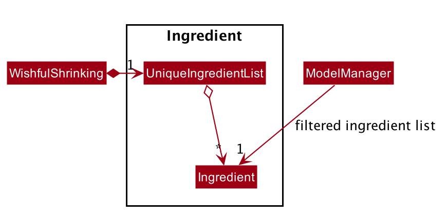

## 7.3 Consumption 
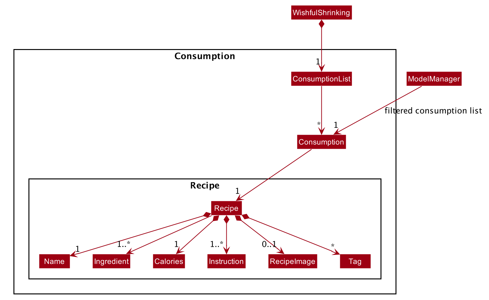

# 8. **Appendix E: *Effort*** 

| Term             | Scope/ Measured by                                                                                                                                                                                                                                                        |
|------------------|---------------------------------------------------------------------------------------------------------------------------------------------------------------------------------------------------------------------------------------------------------------------------|
| Difficulty level | 1. Involves learning and applying new skill   2. Not built off existing ab3 features   3. Involves many classes   4. Many variations of user input   5. Involves many checks before execution of action   6. Consideration for future enhancements                                    |
| Effort required  | 1. Involves learning and applying new skills   2. Time to implement    3. Complexity of feature   -    Responsive UI   -    Many variations of user input   -    Involves many checks before execution of action   4. Priority of feature which determine extent of testing needed   |
| Achievements     | 1. Feature works as specified and as expected   2. Feature fails gracefully                                                                                                                                                                                                  |

| Point of Comparison                    | AB3                                                                                                                                                                                              | Wishful Shrinking                                                                                                                                                                                                                                                                                                                                                                                                                                                                                                                                                                                                              |
|----------------------------------------|--------------------------------------------------------------------------------------------------------------------------------------------------------------------------------------------------|--------------------------------------------------------------------------------------------------------------------------------------------------------------------------------------------------------------------------------------------------------------------------------------------------------------------------------------------------------------------------------------------------------------------------------------------------------------------------------------------------------------------------------------------------------------------------------------------------------------------------------|
| Complexity of fields and checks needed | Simple checks for email, alphanumeric and numeric characters                                                                                                                                     | Difficulty: 5/5   Effort: 5/5    Checks for alphanumeric, validity of value of input integer, float (fractions and decimals), and alphabets.   For example, the quantity field of the ingredient involves extensive checks on whether they are of the correct format and whether the number portion of quantity which allows fractions, decimals or integers is positive.    The presence of multiple ingredients and instructions in recipe also required additional validity checks and parsing.                                                                                                              |
| Duplicates                             | Duplicate contact means equal values for every field without consideration for upper and lower cases. This will miss out the case where two strings are the same but do not have the same cases. | Difficulty: 5/5   Effort: 5/5    Duplicate recipes mean only equal values for recipe name and ingredient names regardless of order. Also needed to check for duplicate ingredients in add and edit recipes. Checks for duplicate recipes vary for add and edit command. In add command it checks for equal recipe name and ingredient names regardless of order and not taking into account cases while in edit command it checks for equality of all fields regardless of order and taking into account cases.    Wishful Shrinking takes into account upper and lower cases when checking for duplicate items.   |
| Data Fetching                          | No online data fetching                                                                                                                                                                          | Difficulty: 5/5   Effort: 5/5    Allows users to download images from the internet and save locally if they are connected to the internet. Otherwise the app displays a default image and users can update it later.    An  asynchronous HTTP request is sent whenever the user adds an image. The response will then be read as byte stream and written to a local image file.                                                                                                                                                                                                                                    |
| UI                                     | Simple UI                                                                                                                                                                                        | Difficulty: 5/5    Effort: 5/5     Extensive additions of responsive and helpful UI components such as drawer, text area and cards.    To make the UI responsive, a lot of event listeners and bindings were implemented to connect all components together. This way all components will be updated if one of them changes in size.     We have done extensive research on JFoenix library in order to use its components.                                                                                                                                                                                     |

**Achievements**: After having spent a lot of time doing research on the home cooking market as well as recipe structures, we created a software solution for busy office workers who want to eat home-cooked meals. We have successfully applied the real world interactions between home cooking related objects to our OOP solution. 
