Welcome to the Wishful Shrinking User Guide! This user guide provides in-depth documentation on the installation process, step-by-step instructions for each feature and troubleshooting recommendations. Wishful Shrinking is available for the Linux, Unix, Windows and Mac OS operating systems.

## Introducing Wishful Shrinking
Wishful Shrinking is your desktop diet manager. It is an app that helps you manage your on-hand ingredients, organise personal recipes and track your diet. Wishful Shrinking facilitates a healthier diet in three main ways: 
1. Provide a source of healthy, customizable recipes 
2. Recommend recipes to improve ease of home cooking 
3. Track daily food and calorie intake  

Wishful Shrinking targets busy office workers who tend to discount healthy eating. Office workers are also more familiar with desktop applications and typing and correspondingly, Wishful Shrinking is optimized for fast and efficient typers as it uses a Command Line Interface (CLI) with the added beauty of a Graphical User Interface (GUI).  

Choose a topic from the table of contents to get started on your Wishful Shrinking journey. 

* Table of Contents
{:toc}

--------------------------------------------------------------------------------------------------------------------

## Quick start

1. Ensure your computer has Java `11` or above installed.

2. Download the latest `wishfulShrinking.jar` from [here](https://github.com/AY2021S1-CS2103T-W10-2/tp/releases).

3. Copy the file to an empty folder you want to use as the _home folder_.

4. **Double-click** the jar file to start the app OR start the app using **CLI** and type `java -jar <jar file name>.jar`. 
   The app should look similar to the one shows below: 
   

5. Below is a brief explanation of Wishful Shrinking's components. 
   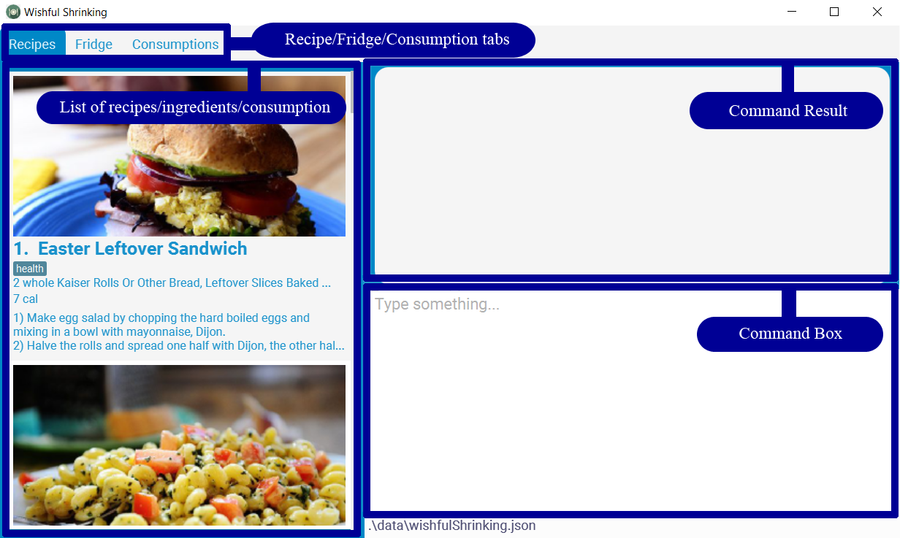
   * List of recipes/ingredients/consumption: The left window will display either a list of recipes, a list of ingredients or the consumption list depending on your input. In the image above, it is displaying the recipe list.
   * Command Result: The Command Result box will show the result of your input into the Command Box.
   * Command Box: Here is where you will type all your commands.

6. Type the command in the command box and press `Enter` to execute it. e.g. typing **`help`** and pressing Enter will open the help window. 
   Some example commands you can try:

   * **`recipes`** : Lists all recipes.

   * **`addR`**` n/salad i/lettuce, carrots, olive oil c/40 instr/Prepare the ingredients. Toss the ingredients together. Serve. img/https://www.onceuponachef.com/images/2019/07/Big-Italian-Salad.jpg t/yummy t/healthy` : Adds a `salad` recipe to Wishful Shrinking.

   * **`deleteR`**`3` : Deletes the 3rd recipe shown in the current list.

   * **`exit`** : Exits the app.

7. Refer to the [Features](#features) below for details of each command.

--------------------------------------------------------------------------------------------------------------------

# Features

**:information_source: Notes about the command format:** 

* Words in `UPPER_CASE` are the parameters to be supplied by the user. 
  e.g. in `add n/NAME`, `NAME` is a parameter which can be used as `addR n/salad`.

* Items in square brackets are optional. 
  e.g `n/NAME [t/TAG]` can be used as `n/Salad t/healthy` or as `n/Salad`.

* Items with `…`​ after them can be used more than 1 times. 
  e.g. `[t/TAG]…​` can be used as `t/healthy`, `t/healthy t/low calories` etc.

* Parameters can be in any order. 
  e.g. if the command specifies `n/NAME i/INGREDIENTS`, `i/INGREDIENTS n/NAME` is also acceptable.

 

### Viewing help : `help`

Shows a message explaining how to access the help page.

Format: `help`
  

### Exiting the program : `exit`

Exits the program.

Format: `exit`
  

## Recipe

### Adding a recipe: `addR`

Adds a recipe to Recipe list.

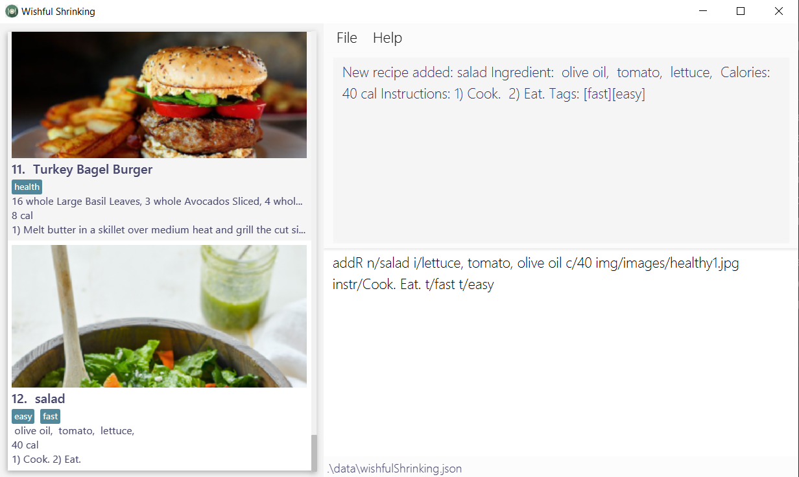

Format: `addR n/TITLE i/INGREDIENT [ -QUANTITY][, MORE INGREDIENTS [ -QUANTITY]] c/CALORIES img/IMAGE inst/INSTRUCTION... [t/TAG]...`

* `INGREDIENT` can take in an optional `Quantity` e.g. i/Tomato -2 whole
    * there is a mandatory space before `-` 
* `CALORIES` **must be a positive integer** e.g. 100, 200, 300......
* `IMAGE` can be local path e.g. images/healthy1.jpg or url e.g. https://vaya.in/recipes/wp-content/uploads/2018/06/Club-sandwich.jpg
   * If you want to use an image that has been saved in your computer, you have to copy that image into Wishful Shrinking's data folder. Then, replace IMAGE in img/IMAGE with the file name of your image, e.g. img/myimage.png.
   * If you want to use a url as the image, make sure that you are connected to the internet on your computer, and that the url is the **image address** (starting with https:// and ending with .jpg/jpeg/png).
   * If you input an invalid file path, or input a url while there is no internet, Wishful Shrinking will replace the image with a default image.
* Each `INSTRUCTION` is separated by a `.` e.g. instr/Cook. Eat.
   * You don't have to number the steps, Wishful Shrinking will number each instruction after separating by `.`

Examples:
* `addR n/salad i/lettuce, tomato, olive oil c/40 img/images/healthy1.jpg instr/Cook. Eat. t/fast t/easy`
* `addR n/sandwiches i/breads, cheese -2 slices c/80 img/https://vaya.in/recipes/wp-content/uploads/2018/06/Club-sandwich.jpg instr/Cook. Eat.`
  

### Listing all recipes : `recipes`

Shows a list of all recipes in the Recipe list.

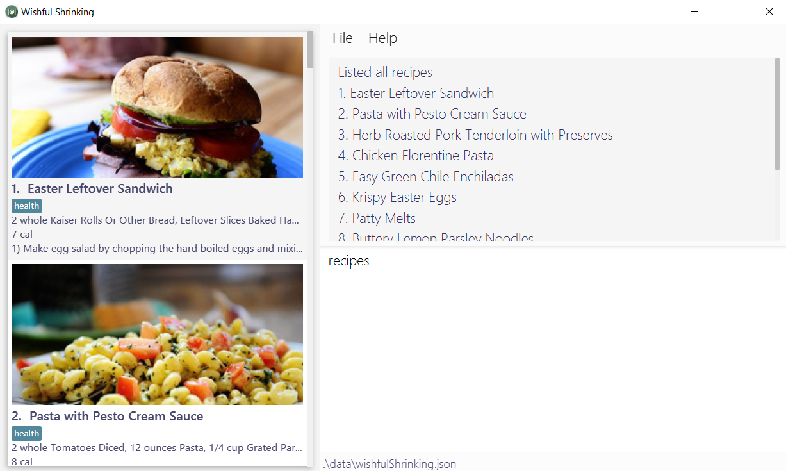

Format: `recipes`
  

### Selecting a single recipe : `selectR`

Displays the information of a single recipe in full view.

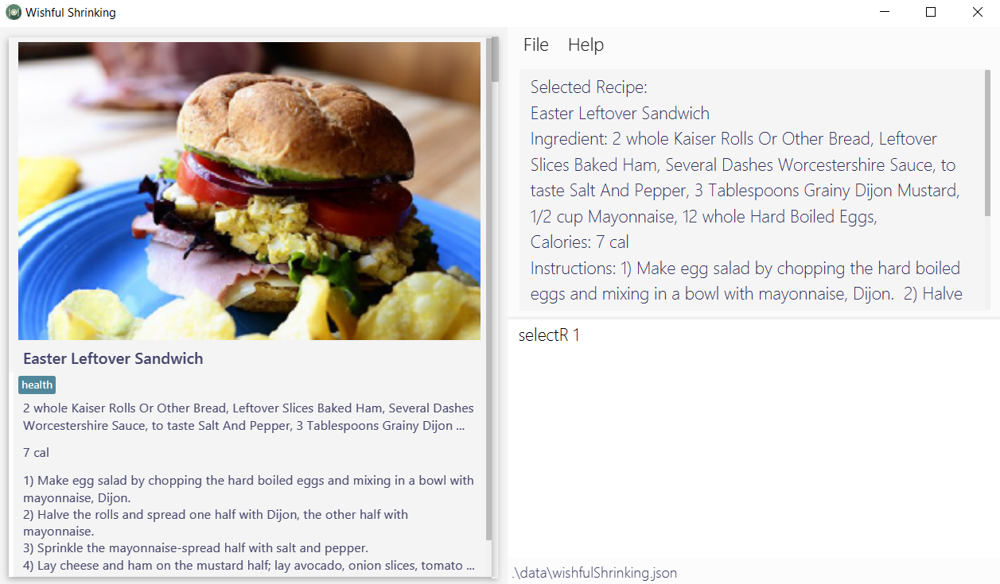

Format: `selectR INDEX`

* Selects the recipe at the specified `INDEX` to show its full information.
* The index refers to the index number shown in the displayed recipe list.
* The index **must be a positive integer** e.g. 1, 2, 3......

Examples:
* `selectR 1` shows the 1st recipe in full view (left drawer), as well as in the command result box on the right.
  

### Closing the recipe drawer : `close`

Closes the left drawer (if opened after selecting a recipe).

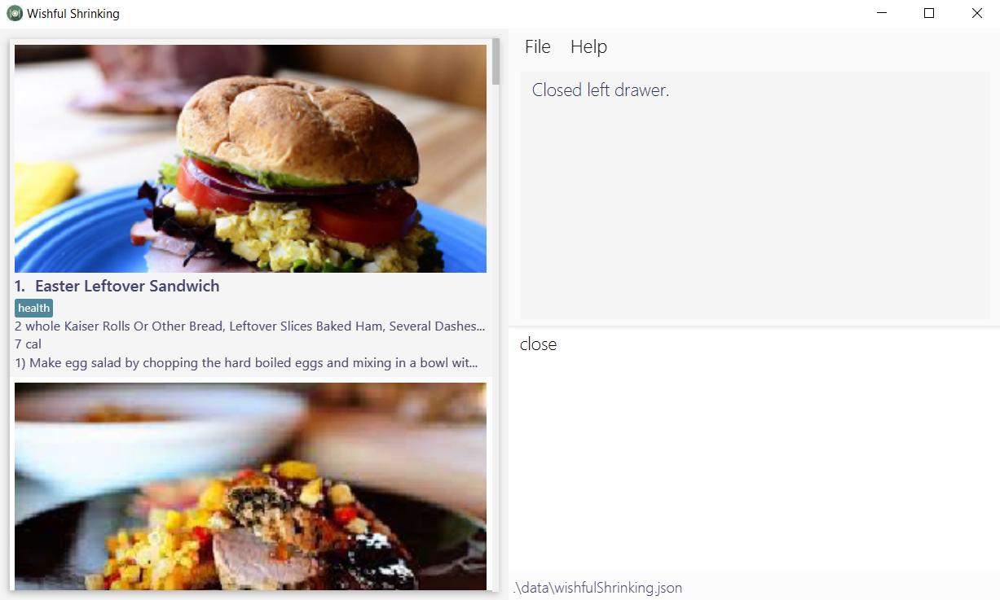

Format: `close`

* This command closes the left drawer that is opened after you have selected a recipe.
  

### Deleting a recipe : `deleteR`

Deletes the specified recipe from the Recipe list.

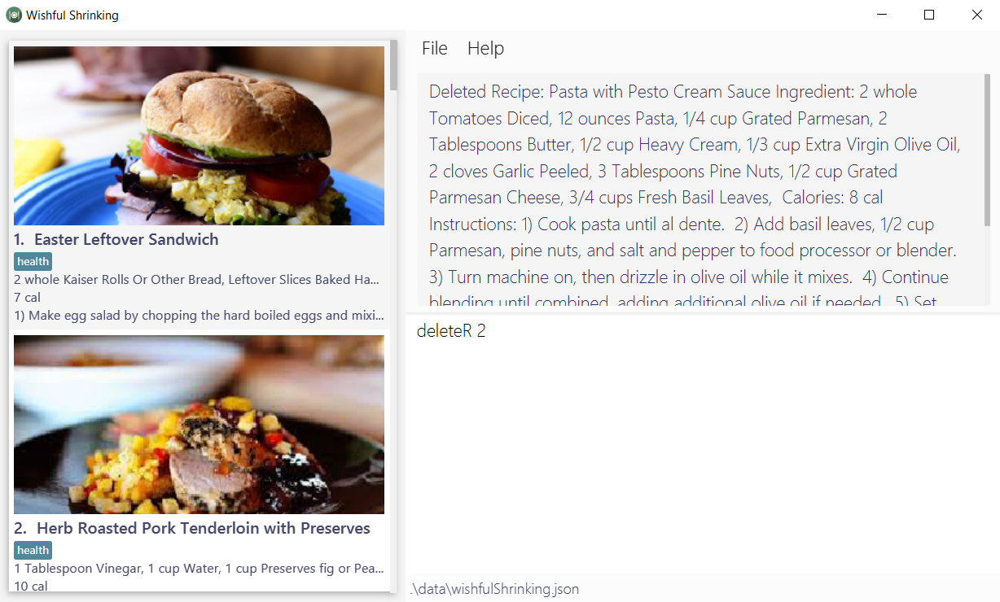

Format: `deleteR INDEX`

* Deletes the recipe at the specified `INDEX`.
* The index refers to the index number shown in the displayed recipe list.
* The index **must be a positive integer** e.g. 1, 2, 3......

Examples:
* `recipes` followed by `deleteR 2` deletes the 2nd recipe in Recipe list.
* `searchR n/salad` followed by `deleteR 1` deletes the 1st recipe in the result of the `searchR` command.
  

### Editing a recipe: `editR`

Edits the specified recipe from the Recipe list.

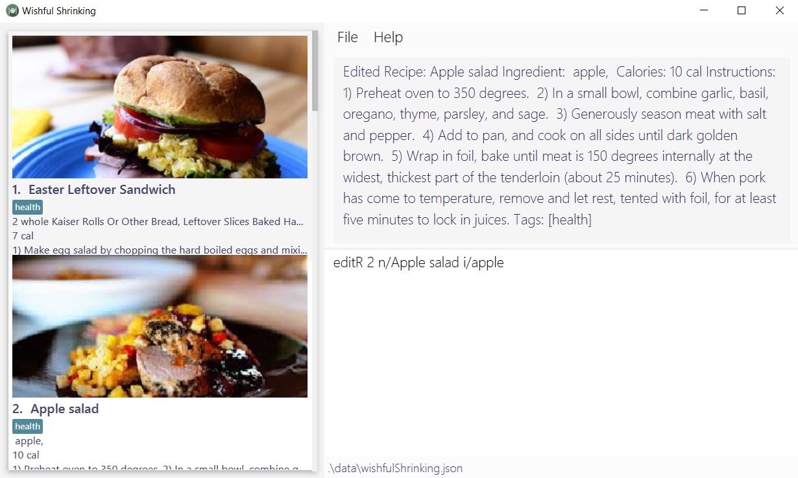

Format: `editR INDEX [n/TITLE] [i/INGREDIENT [ -QUANTITY][, MORE INGREDIENTS [ -QUANTITY]]] [c/CALORIES] [img/IMAGE] 
[inst/INSTRUCTION...] [t/TAG]...`

* Edits the recipe at the specified `INDEX`.
* The index refers to the index number shown in the displayed recipe list.
* The index **must be a positive integer** e.g. 1, 2, 3......
* Note: All fields are optional, but **at least one** of the fields must be present. There can be any number of fields to edit.
* Note: You are not allowed to edit a recipe into another recipe that is already in the recipe list
* Note: Use carefully as this command will override the existing values with the new values
* Tip: Typing `editR INDEX` and then hitting `Enter` will insert the information of the recipe at the specified `INDEX` into the command box, letting you directly modify the existing recipe

Examples:
* `editR 2 n/Apple salad i/apple` will update the name of the 2nd recipe in the displayed recipe list to Apple salad and the ingredients to contain an apple ingredient.
  

### Getting a recipe to edit: `editR`

Adds the information of the specified recipe to the edit command into the command box for editing purposes.

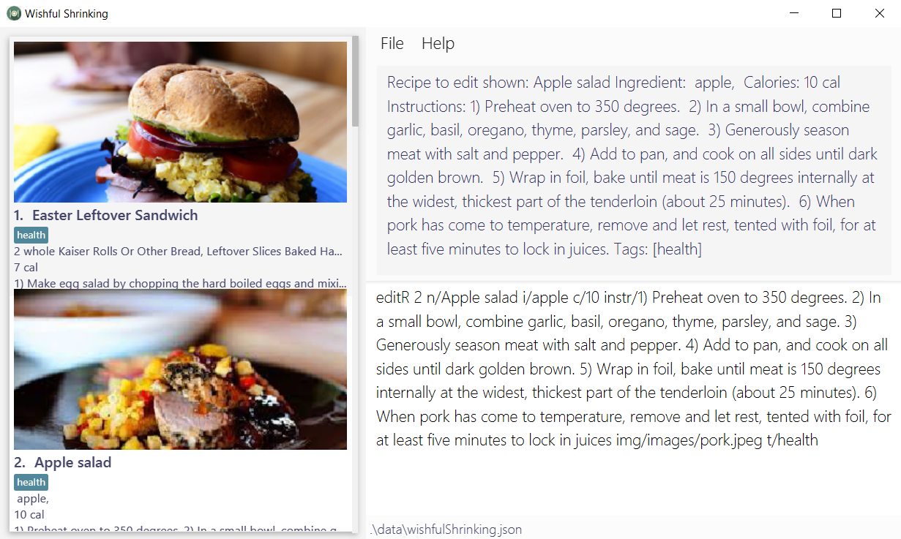

Format: `editR INDEX`

* Gets the information of the recipe at the specified `INDEX` and adds it behind the edit recipe command in the command box
* The index refers to the index number shown in the displayed recipe list.
* The index **must be a positive integer** e.g. 1, 2, 3......

Examples:
* `editR 2` followed by `Enter` will insert the information of the 2nd recipe in the displayed recipe list into the command box.
  

### Searching for a recipe: `searchR`

Finds recipes in the Recipe list that contains all the specified ingredients OR whose title OR tags contain any of the given keywords.

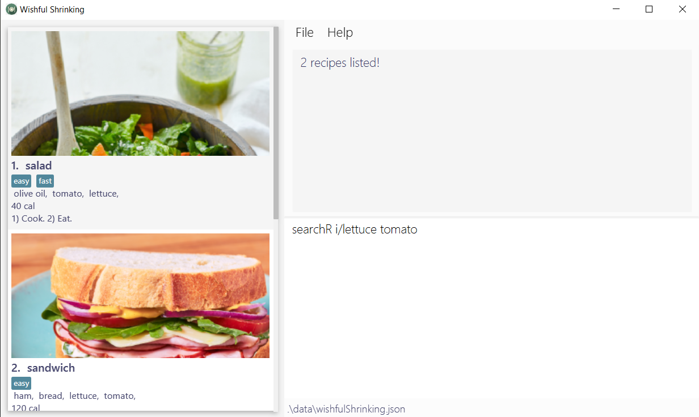

Format: `searchR [i/INGREDIENT [MORE_INGREDIENT]] [n/TITLE [MORE_TITLE]] [t/TAG [MORE_TAG]]`

* The search is case-insensitive. e.g `salad` will match `Salad`
* Note: All fields are optional, but **only one** of the fields must be present. You can only search by the recipe ingredient OR recipe title OR recipe tag.
* The order of the keywords does not matter. e.g. Ham Salad will match Salad with Ham
* Ingredient are separated by a space

Examples:
* `searchR i/lettuce tomato` returns `salad` that has both ingredients `lettuce` and `tomato`
* `searchR n/salad` returns `salad` and `ham salad`
* `searchR t/healthy` returns `salad` with tag `healthy`
  

### Recommending recipes : `recommend`

Shows a list of all recipes in the Recipes list that can be made with the ingredients in the user's
 fridge.

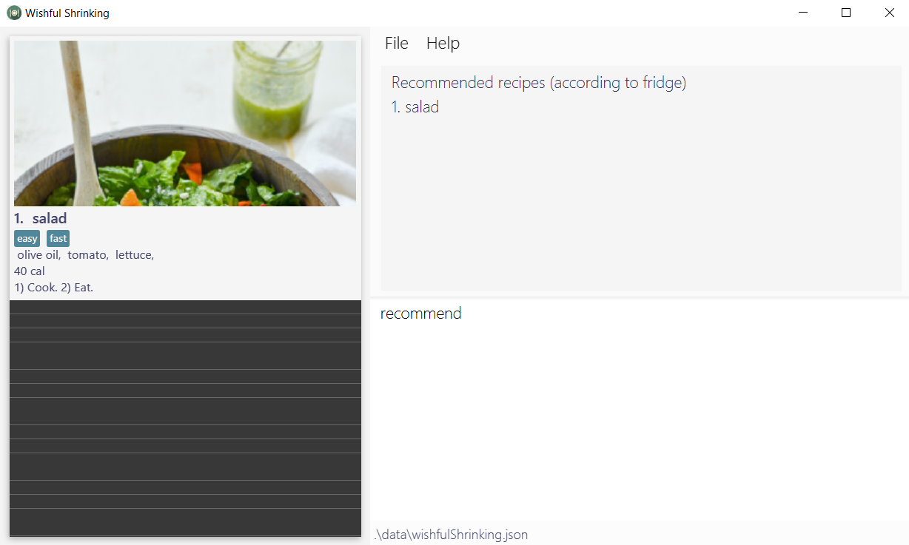

Format: `recommend`

Examples:
* `recommend` returns the recipe `salad` with ingredients `lettuce`, `onion` and `tomato` **only if** the user has all `lettuce`, `onion` and `tomato` in their fridge
  

### Clearing all recipes : `clearR`

Clears all the recipes in the Recipe list.

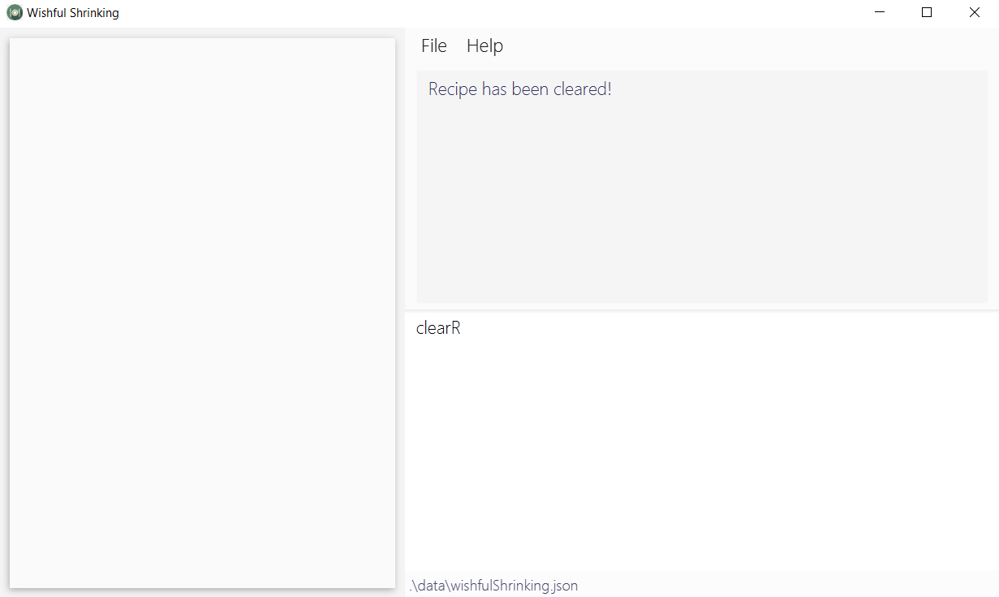

Format: `clearR`
  

## Fridge

### Adding an ingredient: `addF`

Adds an ingredient to the Fridge.

Format: `addF i/INGREDIENT [ -QUANTITY][, MORE INGREDIENTS [ -QUANTITY]]`

* `INGREDIENT` can take in an optional `Quantity` e.g. i/Tomato -2 whole
    * there is a mandatory space before `-` 

Examples:
* `addF i/peanut`
* `addF i/tomato -1 kg`
* `addF i/banana -3/4 cups, green peas -200g, salmon fish`
  

### Listing all ingredients : `fridge`

Shows a list of all ingredients in the Fridge.

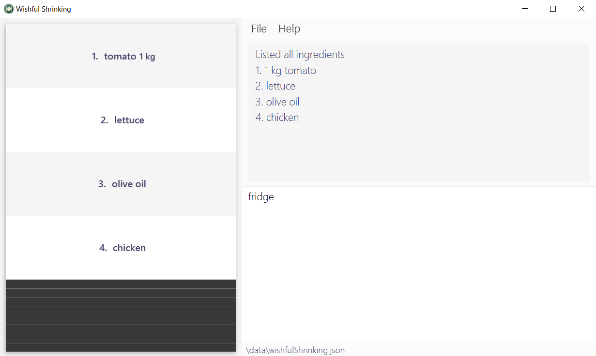

Format: `fridge`
  

### Deleting an ingredient : `deleteF`

Deletes the specified ingredient from the Fridge.

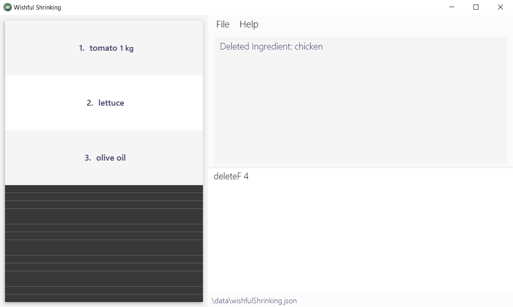

Format: `deleteF INDEX`

* Deletes the ingredient at the specified `INDEX`.
* The index refers to the index number shown in the displayed ingredient list.
* The index **must be a positive integer** e.g. 1, 2, 3......

Examples:
* `fridge` followed by `deleteF 4` deletes the 4th ingredient in the fridge.
* `searchF peanut` followed by `deleteF 1` deletes the 1st ingredient in the results of the `searchF` command.
  

### Editing an ingredient: `editF`

Edits the specified ingredient from Fridge.

Format: `editF INDEX i/INGREDIENT [ -QUANTITY]`

* Edits the ingredient at the specified `INDEX`.
* The index refers to the index number shown in the displayed ingredient list.
* The index **must be a positive integer** e.g. 1, 2, 3......
* Note: All fields are optional, but **at least one** of the fields must be present.
* Note: You are not allowed to edit an ingredient into another ingredient that is already in the ingredient list
* Note: Use carefully as this command will override the existing values with the new values
* Tip: Typing `editF INDEX` and then hitting `Enter` will insert the information of the ingredient at the specified `INDEX` into the command box, letting you directly modify the existing ingredient

Examples:
* `editF 2 i/apple` will update the value of the 2nd recipe in the displayed ingredient list to apple.
  

### Getting an ingredient to edit: `editF`

Adds the information of the specified ingredient to the edit command into the command box for editing purposes.

Format: `editF INDEX`

* Gets the information of the ingredient at the specified `INDEX` and adds it behind the edit ingredient command in the command box
* The index refers to the index number shown in the displayed ingredient list.
* The index **must be a positive integer** e.g. 1, 2, 3......

Examples:
* `editF 1` followed by `Enter` will insert the information of the 1st ingredient in the displayed ingredient list into the command box.
  

### Searching for an Ingredient: `searchF`

Finds ingredients in the Fridge that contain any of the given keywords.

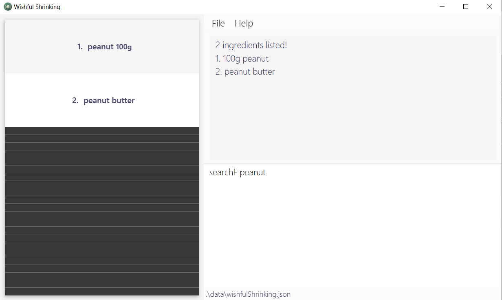

Format: `searchF KEYWORD [MORE_KEYWORDS]`

* The search is case-insensitive. e.g `peanut` will match `Peanut`
* Only the ingredient name is searched.
* The order of the keywords does not matter. e.g. Peanut Butter will match Butter with Peanut

Examples:
* `searchF peanut` returns `peanut` and `peanut butter`
  

### Clearing all ingredients : `clearF`

Clears all the ingredients in the Fridge.

Format: `clearF`
  

## Consumption

### Eating a recipe : `eatR`

Adds the specified recipe in the Recipe list into the Consumption list.

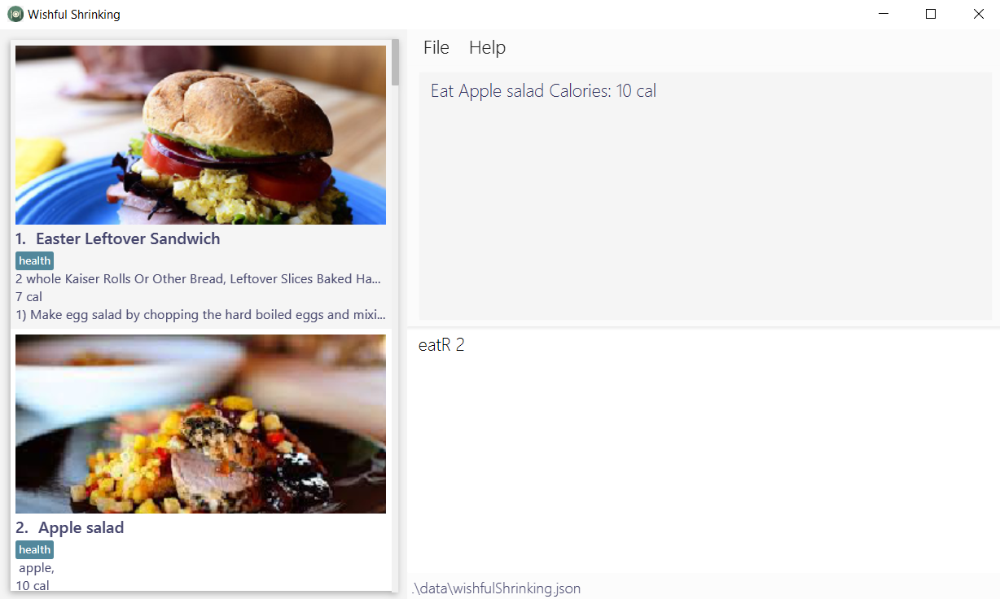

Format: `eatR INDEX`

* Adds the recipe at the specified `INDEX` into the Consumption list.
* The index refers to the index number shown in the displayed recipe list.
* The index **must be a positive integer** e.g. 1, 2, 3......

Examples:
* `recipes` followed by `eatR 2` adds the 2nd recipe in the displayed recipe list into the Consumption list.
* `searchR n/salad` followed by `eatR 1` adds the 1st recipe in the results of the `searchR` command into the Consumption list.
  

### Listing all recipes eaten : `calories`

Shows a list of all recipes that have been eaten by the user.

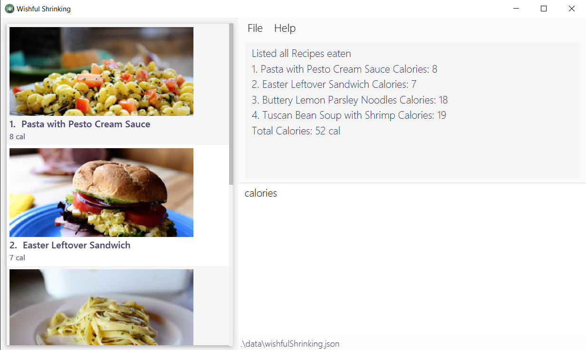

Format: `calories`
  

### Deleting a recipe eaten: `deleteC`

Deletes the specified recipe from consumption list.

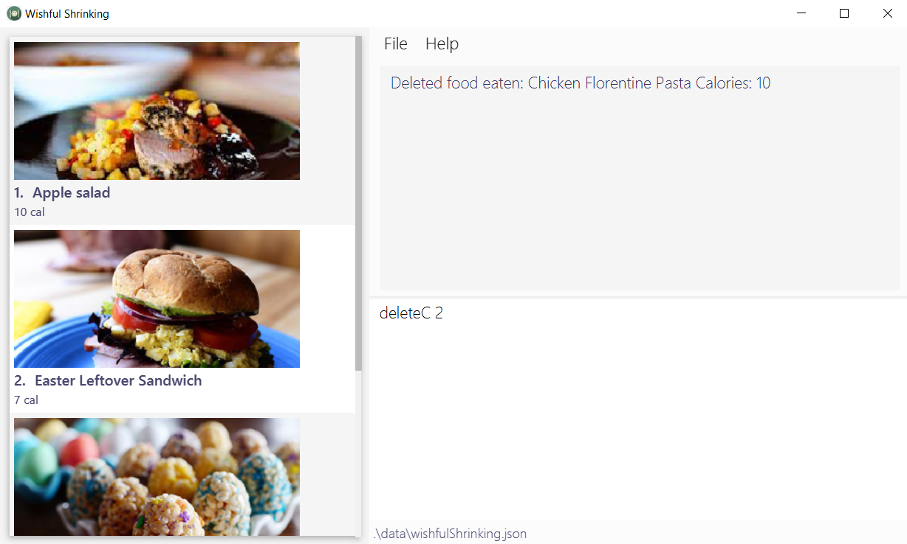

Format: `deleteC INDEX`

* Deletes the recipe at the specified `INDEX`.
* The index refers to the index number shown in the displayed consumption list.
* The index **must be a positive integer** e.g. 1, 2, 3......

Examples:
* `calories` followed by `deleteC 2` deletes the 2nd recipe in Consumption List.
  

### Clearing all consumed recipes in consumption : `clearC`

Clears all the recipes that have been eaten in the daily consumption list.

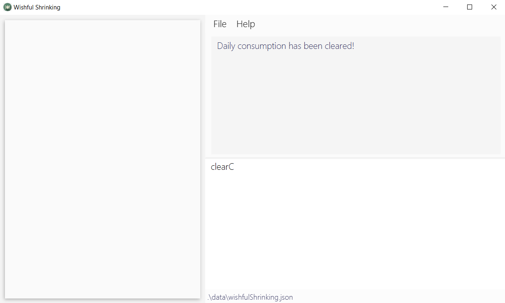

Format: `clearC`
  

## Saving the data

Wishful Shrinking's data is saved in the hard disk automatically after any command that changes the data. There is no need to save manually.
  

--------------------------------------------------------------------------------------------------------------------

# FAQ

**Q**: Why is my data not saved? 
**A**: Remember to copy the jar file to an EMPTY folder before starting the app.
 
 
**Q**: Why is the app not running? 
**A**: Ensure JDK `11` or above is installed.  

--------------------------------------------------------------------------------------------------------------------

# Glossary
**Wishful Shrinking**: Can refer to name of the application as a whole or to the app’s storage file 
**Fridge**: A personalised storage that contains all the ingredients that a user has 
**Recipe**: A set of cooking instructions that describes how to prepare a meal and the ingredients required 
**Ingredient**: Food that can be used to prepare a particular dish according to a recipe 
**Consumption**: A counter which calculates and displays the calorie intake of a user based on the recipes consumed as well as a list of recipes consumed 
**Drawer**: Page that layers above left section of the window when the `select` command runs and closes when the `close` command runs  

--------------------------------------------------------------------------------------------------------------------

# Command summary

Features | Format, Examples
--------|------------------
**Help** | `help`
**Exit** | `exit`
**Add recipe** | `addR n/TITLE i/INGREDIENT [ -QUANTITY][, MORE INGREDIENTS [ -QUANTITY]] c/CALORIES img/IMAGE inst/INSTRUCTION... [t/TAG]...`   e.g. `addR n/salad i/lettuce, tomato, olive oil c/40 img/images/healthy1.jpg instr/Cook. Eat. t/fast t/easy`
**List recipes** | `recipes`
**Select recipe**| `selectR INDEX`   e.g. `selectR 3`
**Close recipe drawer**| `close`
**Delete recipe** | `deleteR INDEX`  e.g. `deleteR 3`
**Edit recipe** | `editR INDEX [n/TITLE] [i/INGREDIENT [ -QUANTITY][, MORE INGREDIENTS [ -QUANTITY]]] [c/CALORIES] [img/IMAGE] [inst/INSTRUCTION...] [t/TAG]...`   e.g. `editR 2 n/Apple salad i/apple`
**Get edit recipe info** | `editR INDEX`   e.g. `editR 2`
**Search for recipe** | `searchR [i/INGREDIENT [MORE_INGREDIENT]] [n/TITLE [MORE_TITLE]] [t/TAG [MORE_TAG]]`   e.g. `searchR i/lettuce tomato`, `searchR n/salad`, `searchR t/healthy`
**Recommend recipe** | `recommend`
**Clear all recipes** | `clearR`
**Add ingredient to the fridge** | `addF i/INGREDIENT [ -QUANTITY][, MORE INGREDIENTS [ -QUANTITY]]`   e.g. `addF i/banana -3/4 cups, green peas -200g, salmon fish`
**List ingredients in the fridge** | `fridge`
**Delete ingredient from the fridge** | `deleteF INDEX`  e.g. `deleteF 3`
**Edit ingredient in the fridge** | `editF INDEX i/INGREDIENTS [ -QUANTITY]`   e.g. `editF 3 i/apple sauce -20.0g`
**Get edit ingredient info** | `editF INDEX`   e.g. `editF 2`
**Search for ingredient in the fridge** | `searchF KEYWORD [MORE_KEYWORDS]`   e.g. `searchF avocado`
**Clear all ingredients from the fridge** | `clearF`
**Eat recipe**| `eatR INDEX`   e.g. `eatR 3`
**List recipes eaten** | `calories`
**Delete recipe eaten**| `deleteC INDEX`   e.g. `deleteC 3`
**Clear all consumed recipes** | `clearC`
